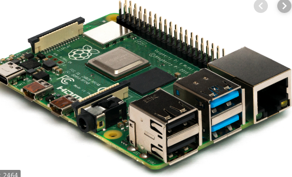
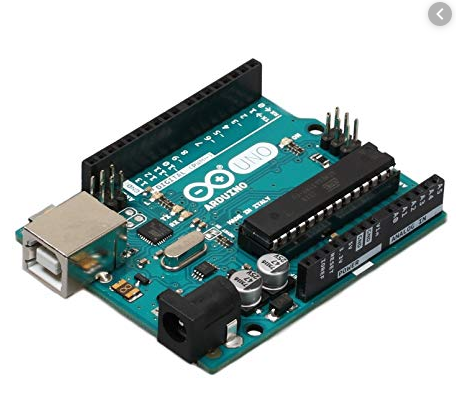
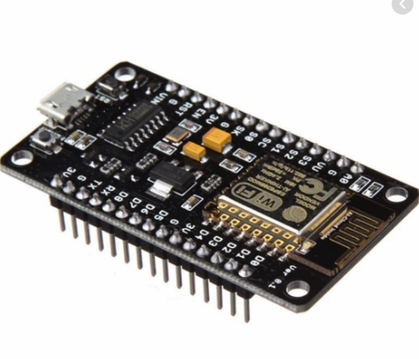
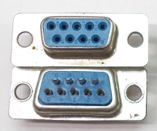

# IoT

Stefan Nožinić (<stefan@lugons.org>)

---
# Šta je IoT

 + Internet of Things
 + ideja je da imamo povezane uređaje na internet kao što su: kućni uređaji, automobili, gadgeti itd...
 + Zavisi od nekoliko oblasti računarstva
   + računarske mreže
   + operativni sistemi i embedded sistemi
   + arhitektura računara
   + baze podataka
   + analiza podataka 

---
# Šta većina IoT sistema sadrži

 + računar
 + periferni uređaji
 + embedded uređaji
 + infrastruktura za povezivanje uređaja
 + sistem za prikupljanje podataka
 + sistem za čuvanje podataka
 + sistem za obradu podataka
 + sistem za prenos podataka
 + sistem za kontrolu

---
# Arhitektura IoT sistema 

 + hijerarhijska
 + peer-to-peer
 + Grid computing?

---
# Raspberry PI

---
# Arduino Uno

---
# ESP8266

---
# Periferni uređaji

 + aktuatori
 + senzori

---
# Načini komunikacije sa perifernim uređajima 

 + polling
 + event-based kroz sistem prekida

---
# Komunikacija sa perifernim uređajima 

 + GPIO
 + one wire
   + 2 konektora: data i GND, data je uvek HIGH kada nema komunikacije,
   + kada master želi da pošalje 1 onda stavi data na LOW u periodu od 15µs
   + za 0 stavi LOW na 60µs
   + za primanje podataka, master šalje LOW na 15µs, slave ako želi poslati 1 ne radi ništa
   + ako želi da pošalje 0, postavi data line na LOW na 60µs
 + SPI
   + 4 pina, SCLK, MOSI, MISO, SS (slave select)

---
# Komunikacija sa perifernim uređajima

* RS-232
* I2C
  + serial data line + serial clock line, START-STOP poruke
* USB
* CAN - ceo protokol u OSI modelu
* IR

---
# RS 232 konektor

---
# Komunikacija sa perifernim uređajima

 + 802.3 (Ethernet)
 + 802.11 (WiFi)
 + 802.15 (Bluetooth)

---
# Komunikacija sa centralnom jedinicom (server)

 + praktično svi protokoli iz računarskih mreža
 + Prva dva nivoa OSI modela:
   + GSM
   + 802.11
   + 802.15
   + 802.3

---
# Kounikacija sa centarlnom jedinicom

 + Aplikativni nivo OSI modela
   + MQTT
   + HTTP(S)
   + Telnet
   + custom protokoli
   + ...

---
# Primeri senzora
 + touch panel
 + dugme
 + kompas
 + antena
 + temperaturni senzor
 + proximity senzor
 + senzor pritiska
 + smoke detection senzor

---
# Primeri senzora
 + IR senzor
 + kamera
 + mikrofon
 + akcelerometar
 + žiroskop
 + humidity senzor

---
# Aktuatori

 + elektro-motori
 + LED
 + display
 + štampač
 + zvučnik

---
# Softverska arhitektura embedded sistema

 + lower layer
 + middle llayer
 + higher layer
 + application
 + RPC

---
# Primeri

 + pametne kuće
 + pametni automobili
 + industrijski pogoni
 + pametni gradovi
 + ...
