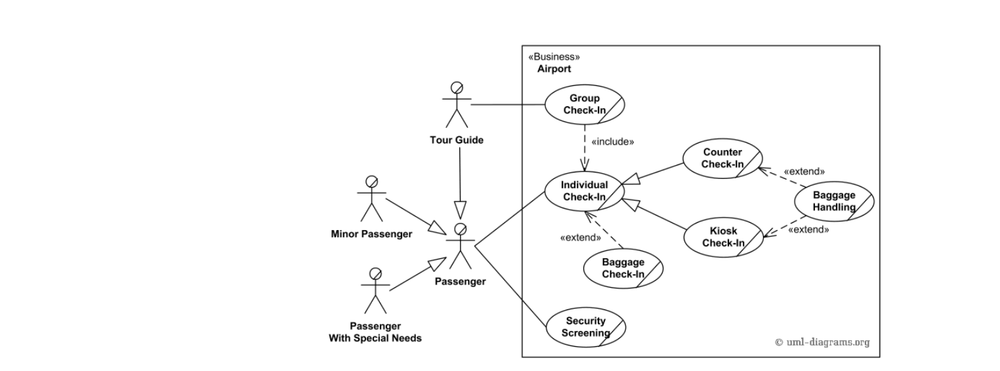

* Modeliranje softvera 

---
# blackbox - sistem

---
# Šta je to informacioni sistem?

* akvizicija podataka 
* čuvanje podataka 
* prenos podataka
* prezentacija podataka
* obrada podataka
* automatizacija u realnim sistemima (kontrola)

---
# Zašto modeliramo softver?

* razumevanje sistema od strane drugih osoba (i nas)
* lakše pronalaženje bagova
* testiranje individualnih modula


---
# Ciljevi dizajniranja softvera 

* održivost
* testabilnost
* upotrebljivost
* sigurnost
* brzina
* dokumentacija

---
# Faze izrade softvera

* analiza biznisa
* analiza zahteva 
* specifikacija arhitekture
* prototip i detaljna specifikacija
* plan verifikacije i validacije 
* implementacija i jedinično testiranje
* sistemsko testiranje
* funkcionalno testiranje
* pisanje korisničke dokumentacije


---
# Analiza biznisa

* intervju
* analiza poslovnih procesa kroz postojeću dokumentaciju
* posmatranje poslovnih procesa
* poređenjem sa postojećim realnim sistemima
* analiza sličnih IS

---
# Analiza korisničkih zahteva

* Razdvajanje zahteva na male komponente 
* po feature-u
* zahtevi mogu biti u obliku "Kada .... i želim da .... onda .... i desi se ..."
* Uzeti u obzir krajnje rokove za dostavljanje softvera
* ograničenja
* standardi koje softver treba da ispunjava?
* funkcionalni i nefunkcionalni zahtevi 

---
# Use Case Diagram




---
# Modeli razvoja

* waterfall
* code and fix
* waterfall sa podelom na podprojekte posle specifikacije arhitekture
* evolutivni razvoj 
* Scrum 

---
# Specifikacija 

* definisanje šta sistem treba da radi
* šta je ulaz a šta izlaz?
* podela na module
* definisane ulaza i izlaza svakog modula
* kako moduli interaguju?


---
# Specifikacija arhitekture

* Da li se koristi neki algoritam koji zahteva specifičnu arhitekturu?
* moduli mogu biti: podsistemi, klase, namespace, aplikacije, ...
* definisati komunikaciju između modula
* specificirati 20% modula koji čine 80% sistema
* svi zahtevi moraju biti pokriveni arhitekturom


--- 
# Obrasci arhitektura

* slojeviti obrazac
* mikroservisi
* pipeline
* event-driven sa deljenim bus-om


---
# Šta još ide u arhitekturu?

* model podataka (koja baza, koji formati fajlova, koje strukture podataka, ...)
* upravljanje resursima (memorija, mrežne konekcije, threadovi, ...)
* Bezbednost i sigurnost 
* Skalabilnost 
* interoperabilnost 
* internacionalizacija i lokalizacija
* upravljanje greškama
* pouzdanost
* okruženje


---
# Alati koji se moraju izlistati u arhitekturi

* build system 
* continious integration 
* continious delivery
* nightly build 
* containerization engine 
* profiling tools
* testing frameworks (unit, integration, system testing)
* code coverage tools
* static code analysis tools
* documentation handling

---

* using existing technologies
* determining stability of system (multiplied stability concern for every component)
* is something done before? how existing code can be reused?
* strategy for handling changes

---
# Primer: Facebook

---
# Facebook

* backend
  + rukovanje grafom
  + autentifikacija i autorizacija 
  + spam filtering
  + content
  + poruke
* frontend
  + komunikacija sa backendom
  + user experience - animacije neke
  + dizajn 

---
# Primer: Microsoft office Excel 

---
# Excel

* parsiranje i izvršavanje izraza
* modul za različite formate fajlova
* jrukovanje stilovima
* modul za integraciju sa ostalim aplikacijama iz istog paketa 


---
# Primer: Igrice 

---
# Igrice 

* logika igre
* fizika
* grafika igre i rendering
* network
* audio 

---
# Primer: Photoshop

---
# Photoshop 

* prikaz slike
* razne transformacije slike
* podrška za različite formate

---
# Primer: Operativni sistem

---
# Operativni sistem

* modul za rukovanje procesorom
* modul za rukovanje procesima
* modul za rukovanje kontrolerima
* modul za sistem datoteka
* modul za rukovanje korisnicima
* grafika?


---
# Implementacija

* OOP, FP, PP, DSL, LP
* SOLID principi
* composite, observer, builder, abstract factory
* OOP: Java, C++, Python
* FP: Haskell, Lisp
* PP: C, Assembly
* LP: Prolog
* DSL: zavisi od namene!


---
# Validacija softvera 

* unit testovi
* funkcionalni testovi


---
# Zašto je pisanje testova važno?

* testiramo modul po modul
* svaki put kad izmenimo softver možemo da vidimo da li svi testirani moduli rade ponovnim pokretanjem testova 


---
# Unit testovi 

* imamo test za svaki modul - test case
* za svaki test case imamo različite scenarije
* test case sadrži i setup i teardown operacije koje se izvršavaju pre svakog testa


---
# Primeri testiranja

* funkcija za sabiranje
* funkcija za pretragu imenika
* predikcija linkova
* kretanje u igrici 
* kompajler 


---
# Pisanje testova u Pythonu 

```python

  import unittest

  class TestStringMethods(unittest.TestCase):

      def test_upper(self):
          self.assertEqual('foo'.upper(), 'FOO')

      def test_isupper(self):
          self.assertTrue('FOO'.isupper())
          self.assertFalse('Foo'.isupper())

      def test_split(self):
          s = 'hello world'
          self.assertEqual(s.split(), 
              ['hello', 'world'])
          with self.assertRaises(TypeError):
              s.split(2)

  if __name__ == '__main__':
      unittest.main()
```

---
# ...

```python
  import unittest

  class SimpleWidgetTestCase(unittest.TestCase):
      def setUp(self):
          self.widget = Widget('The widget')

      def tearDown(self):
          self.widget.dispose()
          self.widget = None

      def test_title(self):
          self.assertEqual(self.widget.get_title(), 
              "The widget")
```


---
# Testabilnost modula

* osobina modula da ga je moguće testirati kao izolovanu celinu
* modul ne treba da zavisi od drugih modula
* ako koristimo neku bazu podataka ili neki onlajn servis, tokom testiranja možemo napraviti "fake" instancu i proslediti modulu


---
# šta uglavnom treba testirati?

* bazne slučajeve
* granične slučajeve
* Ako imamo neku funkciju koja ima svoju inverznu funkciju, testirati g(f(x)) = x
* čim pronađemo bag, treba  napisati test za njega i tek onda ga rešiti
* ako nam tokom razvoja padne na pemt mogući bag, treba napisati test za njega


---
# Pokrivenost koda 

* koliko funkcija je testirano?
* koliko grana izvršavanja je testirano?


---
# Još neke dobre prakse pisanja koda 

* nezavisnost modula
* parametri funkcija treba da budu deskriptivni
* promenljive treba da budu deskriptiivne
* imena funkcija treba da oopisuju šta rade
* parametri funkcije treba da budu ili primitivni tipovi ili neke apstraktne klase
* ne treba mešati previše različitih biblioteka koje nisu standardne
* treba se dobro upoznati sa bibliotekama koje se koriste
* TREBA KORISTITI BIBLIOTEKE KADA POSTOJE 


---
# Pitanja i diskusija 
