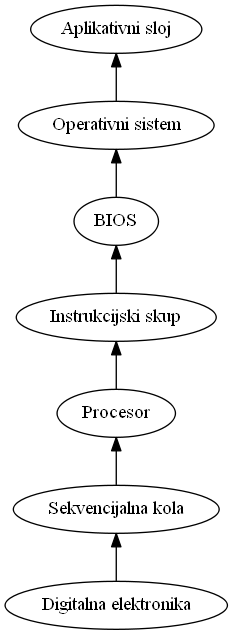
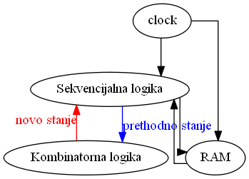
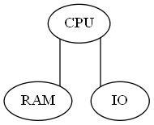

# Operativni sistemi 

Stefan  Nožinić (stefan@lugons.org)

---
# Agenda 

* apstrakcija u računarstvu
* model u diskretnom vremenu
* instrukcijski skup 
* arhitektura računara
* CPU, memorija, Ulazno-iylazni podsistem, prekidi


---
# Apstrakcija u računarstvu 

---


---
# Model u diskretnom vremenu

---


---
# Instrukcijski skup

* skup svih insukrukcija koje procesor razume 
* jako primitivne i male operacije
* ipak, dovoljne za opis bilo kakvog programa!
* Dva glavna pristupa
  * RISC
  * CISC

---
# Arhitektura računara


---



---
# CPU 

---
# Tipovi registara na CPU
* program counter - sadrži adresu naredne instrukcije
* akumulatorski registar - sadrži rezultat operacije
* memory base register - sadrži podatke dobijene iz memorije
* adresni registar
* instrukcijski registar - sadrži vrednost instrukcije
* registar stanja - različiti flagovi (zero, sign (S=1 za negativni znak), carry, overflow)
* pokazivač na stek
* registri opšte namene 

---
# Memorija

* SRAM
* DRAM
* eksterni medium

---
# Ulazno izlazni podsistem

* podsistem za komunikaciju sa eksternim uređajima
* na primer, HDD, USB, PCIe, ...

---
# Prekidi

* način da se softver obavesti o određenim događajima sa spoljašnje strane

```asm
rutina1:
  instrukcija 
  instrukcija 
  instrukcija 

rutina2:
  instrukcija 
  instrukcija 

main:
  prva instrukcija koja se izvrsava
  registracija prekida za rutina1 i rutina2
  instrukcija 
  instrukcija 
  instrukcija 
```

* prekidi mogu biti softverski i hardverski
* nastaju prilikom pobude određenih pinova  na CPU

---
# Elementi OS


+ komunikacija sa BIOS-om
+ upravljanje memorijom
+ sistem datoteka
+ upravljanje procesima
+ komandna linija
+ podsistem za ulazno izlazne uređaje
+ grafičko okruženje

---
# Procesi

+ Proces se sastoji iz tri dela:
  + status aktivnosti (active / inactive)
  + slika procesa 
   + atributi

---

+ Slika procesa se sastoji iz:
  + koda - lista instrukcija
  + stek
  + memorijski blokovi korišćeni od strane procesa
  + stanje svih registara

---
+ attributes: 
  + stanje procesa - spreman, čeka, neaktivan
  + prioritet
+ quantum: vreme dostupno da se pojedinačni proces izvršava pre nego što ode u stanje čekanja


---
# CPU komponenta

+ daje pristup ostalim delovima sistema za rukovanje prekidima 


---
# Komponenta za rukovanje procesima

+ kreiranje procesa
+ ubijanje procesa 

---
# Višenitno programiranje

+ Dva procesa se mogu izvršavati paralelno ili pseudo paralelno
+ posebna pažnja se stavlja da dva procesa ne koriste isti resurs u isto vreme (race condition)
+ ovo se omogućava upotrebom mutexa
+ mutex ima lock operaciju koja je atomičnac  (ne može biti prekinuta)
+ kada je mutex već zaključan, pokušaj zaključavanja blokira proces dok mutex ne postane otključan od strane drugog procesa


---

```
  thread1()
  {
	  mutex.lock() // will block if mutex is already locked
	  do_stuff()
	  mutex.unlock()
  }

  thread2()
  {
	  mutex.lock() // will block if mutex is already locked
	  do_stuff()
	  mutex.unlock()
  }
  ```

  ---
  # Atomičke sekcije


+ sekcija u programu koja ne može biti prekinuta 


---
# Problem 5 filozofa


+ imamo 5 filozofa i 5 kašika i svakom trebaju dve da bi jeo (leva i desna od njega)
+ svaki filoyof uzima jednu po jednu kašiku i čeka dok nema dve 
+ problemi_

---
+ Rešenje: parni prvo uzmu levu a neparni prvo uzmu desnu

---
# Sinhronizacija semaforima

+ imamo jedan put i jedan semafor
+ automobili mogu da prolaze putem jedan po jedan na semafor signal
+ automobili ne mogu proći kada je semafor isključen
+ automobil prolazi kad semafor signalizira
+ Kada automobil prođe, semafor se isključuje
---
```
stop()
  {
	  mutex.lock()
	  while(! ready)
	  {
		  conditional_variable.wait(lock)
	  }
	  ready = false
  }

  resume()
  {
	  ready = true
	  conditional_variable.notify_one()
  }
  ```

  ---
  # Tajmer

  
+ tajmer je posebna vrsta drajvera koji registruje prekid na otkucaj tajmera i tokom obrade prekida:
    + povećava sistemsko vreme
    + provere da li je trenutni proces aktivan iznad vremenskog ograničenja (quantum)
    + povećava ukupno vreme tekućeg procesa
    + proverava da li bi se procesi u snu trebali probuditi
    + statistika

---
# Raspoređivanje procesa

+ schedulng je proces dovođenja procesa u aktivni režim i pauziranja drugih procesa
+ tako da planer mora staviti aktivni proces na čekanje i aktivirati drugi sa liste spremnih procesa sa najvećim prioritetom
---
# Upravljački programi


+ otkriva upravljački interfejs
+ za svaku klasu I / O uređaja ovaj modul otkriva poseban upravljački interfejs tako da se upravljački programi mogu implementirati
+ ovaj modul za svaku klasu U / I uređaja stvara apstrakciju

---
# HDD - organizacija

+ kontrolna jedinica:
    + kontrolna logika
    + adresni registar
    + registar podataka
    + registar statusa
    + sistem upravljanja vremenom
+ jedinica za skladištenje podataka:
    + adresni mehanizam
    + medijum za memoriju
    + impulsna kola
    + izlazna pojačala
---
+ adresni prostor zasnovan je na cilindričnim koordinatama (p, phi, z)
+ staza je krug za zadati radijus na zadanoj visini
+ cilindar je postavljen za sve staze na različitim visinama za dati radijus
+ sektor je deo kruga
+ između svaka dva sektora postoji međusektorska zona
+ pa se svaki sektor može adresirati kao (u, c, t, s) gde je u broj uređaja, c je cilindar, t je staza i s je broj sektora
---

+ kapacitet sektora je K i obično je K = 512B
+ kapacitet celog diska: KSTC
+ sektor ima zaglavlje, kontrolni rep (ECC, CRC) i segmente podataka

---
+ za prenos koristimo I / O podsistem
+ u I / O podsistemu možemo prenositi samo blokove, blok je konstantan broj uzastopnih sektora na jednom tragu
+ transfer:
    + prenos bloka u RAM (sistemska zona)
    + aktiviranje I / O podsistema
    + čekanje da se transfer završi

---

+ takođe deluje obrnuto za čitanje
+ I / O podsistem ima svoj propusni opseg koji zavisi od širine linije podataka i njegove frekvencije takta
+ tako CPU šalje na kontroler diska:
    + R / V
    + adresa u RAM-u
    + adresa na disku
    + dužina u blokovima

---
# Primer čitanja u x86 asm

```
  DAPACK:
          db      0x10
          db      0
  blkcnt: dw      16              ; read 16 blocks, int 13 resets this to # of blocks actually read/written
  db_add: dw      0x7C00          ; memory buffer destination address (0:7c00)
          dw      0               ; in memory page zero
  d_lba:  dd      1               ; put the lba to read in this spot
          dd      0               ; more storage bytes only for big lba's ( > 4 bytes )
   
          mov si, DAPACK          ; address of "disk address packet"
          mov ah, 0x42            ; AL is unused
          mov dl, 0x80            ; drive number 0 (OR the drive # with 0x80)
          int 0x13
          jc short .error
```

---
# Tabele u OS vezane za diskove

---
# Mount table 

+ sadrži opis uređaja i lokacije za montiranje
+ sadrži rutine za rad sa uređajem

---
# Tabela raspodele (allocation table)

po uređaju

+ sadrži imena datoteka i opise
+ čvorovi indeksa
+ ekstenzija datoteke
+ vrsta datoteke (binarna ili tekstualna)
+ verzija
+ vlasnik, grupa i dozvole
+ veličina
+ vreme stvaranja i modifikacije
+ skriveno, sistem itd
+ drugi atributi
+ početna adresa bloka ili niz adresa svih blokova

---
# Tabela deskriptora datoteka

formirano po aplikaciji koja se izvodi u OS-u

+ ime datoteke 
+ dozvole (čitanje / pisanje)
+ trenutni položaj

uvek ima najmanje 3 datoteke otvorene: standardni ulaz, standardni izlaz i standardni izlaz za greške koje su posebne datoteke

---
# Tabela otvorenih datoteka

jedna tabela u celom sistemu

---
# Memorijski modul

izlaže:

+ dodeljivanje memorije
+ free(....) funkcionalnost
---
# Memory management 

+ fizička adresa je realna adresa u memoriji dok je logička adresa adresa iz adresnog prostora konkretnog procesa
+ procesi pristupaju memoriji upotrebom logičkog adresnog prostora, MMU (memory management unit) pretvara logičku u fizičku adresu:
    + provera da li je adresa van dostupnog opsega, ako jeste, prijavljuje grešku (izuzetak)
    + dodaje baznu adresu na logičku adresu


---
# Paging 

+ Svaka stranica memorije ima svoj logički prostor
+ prvih n bita predstavlja stranicu a ostatak logičku adresu


---
# Sistem datoteka - filesystem


---
# terminologija

+ disk - uređaj za čuvanje podataka
+ disk block - minimalna količina podataka za upis i čitanje 
+ block - minimalna količina podataka nad kojom se vrše operacije u OS
+ volume - logička reprezentacija diska ili particije diska (dela diska)
+ superblock - zaglavlje volume-a
+ inode - mesto za čuvanje meta podataka o fajlu (FCB, file record)
+ extent - uređeni par početnog bloka i dužine fajla u blokovima
+ attribute - uređeni par ključ ' vrednost (npr ime datoteke, veličina itd)

---
# file metadata 

+ ime datoteke
+ vlasnik datoteke
+ dozvole pristupa
+ veličina datoteke
+ vreme kreiranja
+ vreme poslednjeg čitanja
+ vreme poslednjeg pisanja
+ tip datoteke
+ pokazivač na direktorijum u kom se nalazi datoteka
+ pokazivač na prvi blok ili listu blokova 

neke implementacije čuvaju pokazivač na niz pokazivača na blokove ili pokazivač na niz pokazivača na nizove pokazivača na blokove

drugi način je da se čuva lista extent-a 

---
# Direktorijum 

čuva listu pokazivača na inode-ove

Sadržaj direktorijuma se može predstaviti različitim strukturama podataka

+ B tree
+ B* tree
+ B+ tree 
+ hash tabela

---
# Operacija koje pruža file system

---
# Inicijalizacija 

+ kreiranje super bloka i inicijalizacija fajl sistema
+ upis inode-a za korenski direktorijum u super blok 
+ Ovaj posao se obavlja od strane posebnog programa a ne samog drajvera za fajl sistem 

---
# Montiranje 

+ Provera da li je fajl sistem pravilno demontiran prilikom poslednje upotrebe
+ popravka u slučaju grešaka
+ prebacivanje super bloka u RAM za lakši pristup

---
# Demontiranje

+ Svi baferovani podaci u RAM-u se upisuju na FS 
+ modifikacija indikatora uspešnog demontiranja u super bloku

---
# Kreiranje fajla

+ kao parametar uzima direktorijum i ime fajla i kreira inode

---
# Kreiranje direktorijuma

+ kao parametar prima roditeljski direktorijum i ime novog direktorijuma
+ kreira inode
+ inicijalizacija sadržaja direktorijuma
+ inicijalizacija reference na sebe i roditeljski direktorijum 

---
# Otvaranje datoteka

+ kao parametar prima inode direktorijuma i ime fajla 
+ traži potreban inode za dati fajl
+ provera permisija
+ vraća handle kao povratnu vrednost sa kojom se vrši upis i čitanje od strane aplikativnih programas

---
# Upis u fajlove

+ Parametri: handle, pozicija u fajlu gde se upisuje, pokazivač na lokaciju u RAM i dužina podataka
+ upis podataka u datoteku
+ dodavanje novih blokova i modifikacija inode-a ako je potrebno
+ modifikacija meta podataka npr last write

---
# Čitanje fajlova

+ Parametri: handle, pozicija u fajlu gde se čita, pokazivač na lokaciju u RAM i dužina podataka
+ inkrementiranje potrebnih pokazivača za čitanje
+ modifikacija meta podataka npr last read

---
# Brisanje datoteke

+ provera da li je datoteka u upotrebi
+ brisanje inode-a iz direkktorijuma
+ nekad i brisanje sadržaja

---
# promena imena i pomeranje fajlova

+ uzima imenik izvora, ime izvora, direktorij odredišta i ime odredišta
+ prvi sistem zaključavanja datoteka tako da drugi ne mogu da naprave nered
+ provjerite jesu li izvorni i odredišni direktoriji isti, ako jesu, jednostavno preimenujte datoteku, inače je moramo premjestiti
+ proverite da li odredište nije dete izvora, pređite na koren i pogledajte da li ste pogodili izvor sa odredišta
+ izbrišite odredišno ime ako se odnosi na datoteku ili prazan direktorij
+ obrišite ime izvora iz izvornog direktorija
+ stvorite ime odredišta u direktoriju odredišta
+ promenite nadređeni u odredišni direktorij

---
# Dobavljanje meta podataka

+ kao parametar dobija referencu fajla (često inode)
+ vraća meta podatke za dati inode

---
# upis meta podataka

+ kao čitanje meta podataka, samo modifikacija

---
# Otvaranje direktorijuma

+ kao kod otvaranja fajla

---
# Čitanje direktorijuma 

+ za dati handle, vraća listu uređenih parova (ime, inode)


---
# Dodatne operacije

+ simbolički linkovi - fajlovi koji u sebi sadrže putanju do linkovanog fajla
+ hard links - fajlovi koji sadrže referencu do inode-a
+ memory mapping - direktno mapiranje dela memorije na fajl
+ journaling/Logging
+ access control lists

---
# Journaling 

+ Cilj. zaštita od nekonzistentnog menjanja  
+ Za svaki upis:
  + upisuje se stari sadržaj u dnevnik
  + označava se dnevnik kao registrovan
  + upis podataka normalno
  + označava se dnevnik kao uspešan
+ prilikom provere: 
  + brišemo sve neregistrovane jer se upis nije desio
  + sve uspešne brišemo
  + sve registrovane ali neuspešne, vraćamo podatke koje smo sačuvali u dnevnik u realni fajl sistem

---
# Demoni
+ procesi pokrenuti u pozadini


---
# Zero or empty process 

+ proces koji je uvek pokrenut i koji je praktično beskonačna petlja 
+ potreban jer bi u suprotnom, ako nema drugih procesa, računar se isključio 

---
#  Scheduler for long term 

+ kopiranje slika procesa sa diska ili na disk
+ potrebno jer bi u suprotnom jako malo procesa moglo da bude pokrenuto

---
# Identifier or login

+ autentifikacija korisnika
+ prilikom uspešne autentifikacije, poziva se shell

---
# Punjenje i punjač programa (loader)

---
# Uvod

+ prilikom kompajliranja programa u mašinski kod, dobija se objektni fajl 
+ potrebno je učitati fajl u memoriju i početi izvršavanje programa
+ Svaki objektni fajl ima početnu adresu nula, izvršavanje ovakvog koda je nemoguće na višekorisničkom OS
+ potrebna transformacija sa novim adresama izračunae u zavisnosti od toga gde je program učitan u memoriji
+ program može pozivati rutine podprograma koji ne moraju biti poređani pravilnim redosledom
+ program može pozivati rutine eksternih biblioteka
+ segment - minimalna jedinica memorije gde se nalaze kod ili podaci
+ program je skup segmenata, segmenti ne moraju da budu poslagani redom u memoriji

---
# Procedura pokretan

+ validacija i provera dozvola 
+ popunjavanje steka argumentima sa komandne linije
+ inicijalizacija pokazivača na stek i drugih registara
+ alokacija segmenata
+ učitavanje programa u segmente
+ učitavanje eksternih biblioteka
+ linking - računanje vrednosti simboličkih referenci
+ relocation - transformacija adresa u kodu
+ kreiranje procesa

---
# Linux kao primer

+ login
+ shell
+ file system
+ loading
+ scheduling
+ driver interface
+ /proc 
+ /sys