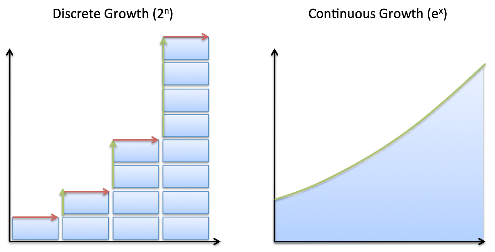
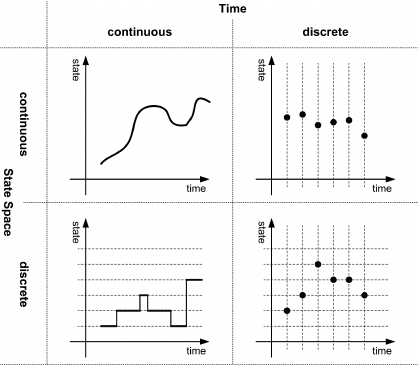
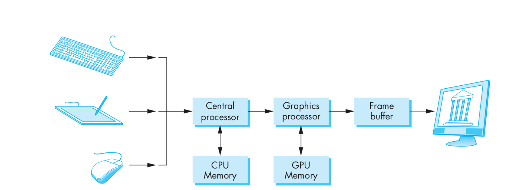
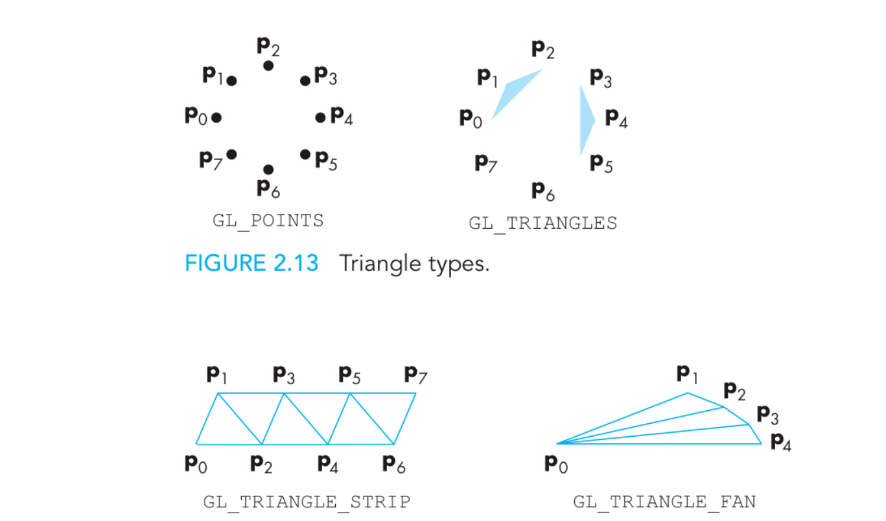

# Računarska grafika (i svašta još nešto)

Stefan Nožinić stefan@lugons.org

---
Agenda 
============

* Reprezentacija 2D slike u računaru
* transformacije 2D slike
* vektorska grafika i rendering 2D slike
* uvod u 3D grafiku
* transformacije u 3D grafici
* arhitektura GPU
* fizika u video igrama

---
# Slika i RGB sistem boja 

* sliku predstavljam kao 2D matricu gde svaka ćelija sadrži trojku (r,g,b)
* brojevi u trojci reprezentuju količinu crvene, zelene i plave boje (3 bajta)
* Razlog za izbor RGB je aditivnost boja (ekran računara radi tako što meša crvenu, zelenu i plavu svetlost da napravi ceo spektrum boja)
* RYB nije moguće koristiti kada radimo sa svetlošću jer, na primer, ne možemo dobiti zelenu boju (za razliku od mastila)


---
# Transformacije nad slikom

* kako možemo posmatrati sliku
* translacija 
* skaliranje
* rotacija

---
# Slika kao signal




---



---
# Slika kao signal 

* model
* $$ I(i,j) $$
* $$ f(x,y) = f(i dx, j dy ) $$

---
# Interpolacija 


---
# Translacija 

* svaku tačku pomerimo za (wx, wy)

---
# Skaliranje 

* računamo vrednost signala između tačaka
* nearest neighbour interpolacija
* bilinearna interpolacija 

---
# Rotacija 

* rotacija oko tačke (0,0)
$$ x' = \cos{\theta}x - \sin{\theta}y $$
$$ y' = \sin{\theta}x + \cos{\theta}y $$

* rotacija oko centra?


---
# Vektorska grafika

* ne čuvamo piksele već informacije o oblicima
* linija
* luk
* ostali oblici 

---
# 3D grafika 

* verteksi (x,y,z)
* objekti se reprezentuju trouglovima
* svaki trougao čine 3 verteksa

---
# Algebarska definicija vektora

* predstava vektora
* apsolutna vrednost vektora
* skalarni proizvod algebarski i geometrijski 
* vektor kroz dve tačke
* radius vektor
* ortogonalni vektori (normalni)
* vektorski proizvod 
* jedinični vektor
* Za nas, niz od 3 ili 4 broja, najčešće tipa float


---
# Matrice
 
* množenje matrice vektorom
* množenje matrica 
* jedinična matrica
* inverzna matrica 

---
# Vektorski prostori 

* linearna kombinacija vektora
* linearna (ne)zavisnost
* definicija vektorskog prostora 
* baza vektorskog prostora 

---
# Vektorska notacija 

* verteks možemo predstaviti kao vektor (x,y,z, w) gde je w=1 uvek 
* sve linearne transformacije (rotacija i skaliranje) možemo predstaviti u matričnom obliku

---
# Matrični oblici transformacija 

* rotacija
* skaliranje

---
# Skaliranje 
$$ S(s_x,s_y,s_z) = \begin{bmatrix} 
s_x & 0 & 0 & 0\\
0 & s_y & 0 & 0\\
0 & 0 & s_z & 0\\
0 & 0 & 0 & 1 \end{bmatrix} $$

---
# Rotacija oko x-ose

$$
R_x(\theta) = \begin{bmatrix} 
1 & 0 & 0 & 0\\
0 & \cos\theta & -\sin\theta & 0\\
0 & \sin\theta & \cos\theta & 0\\
0 & 0 & 0 & 1 \end{bmatrix} 
$$

---
# Translacija 

* translacija 

$$ T(t_x, t_y, t_z) = \begin{bmatrix} 0 & 0 & 0 & t_x\\
 0 & 0 & 0 & t_y\\
  0 & 0 & 0 & t_z\\
   0 & 0 & 0 & 1 \end{bmatrix} $$


---
# Različiti pogledi na objekat 

* $$ x' = TRSx $$ 
* model space
* camera space
* perspektivna projekcija 

---
# Camera space 

* $$ C = R_CT_C $$ 
* imamo up vektor i normalni vektor ravni kamere 
* dobijamo novi vektor iz normalnog i up vektora 
* pravimo matricu A od vektora u,v,n
* $$ C = A^TT $$ 
* $$ T = (-x_c, -y_c, -z_c) $$

---
# perspective transform

* *perspektiva* - bliže stvari su veće
* blize stvari zaklanjaju dalje
* *frustrum* - deo sveta koji vidimo
* FoV, aspect ratio, ...

---

# perspective transform
* od $[-afz, afz]\times[-fz,fz]\times[-z_n,-z_f]$
* do $[-a,a]\times[-1,1]\times[-1,1]$, ali pazeći na perspektivu

---

# perspective transform

* delimo $x$ i $y$ sa $z$
* homogenous divide: $\mathrm{hdiv}(x,y,z,w)=(\frac xw,\frac yw, \frac zw, 1)$
* stavimo $w = -z$


---
# Clipping

* skaliranje na prostor (-1, 1)

---
# GPU arhitektura




---
# GPU pipeline

* vertex shader 
* generisanje primitiva  i clipping 
* rasterizacija  - izlaz je skup fragmenata
* fragment shader


---
# Verteks shader 

```c 
  in vec4 vPosition;

  void main()
  {
    gl_Position = vPosition;
  }
```

---
# Fragment shader 

```c
  void main()
  {
    gl_FragColor = vec4(1.0, 0.0, 0.0, 1.0);
  }
```

---
# Načini iscrtavanja 



---
# Komunikacija sa GPU

* shaderi se kompajliraju i salju na GPU gde se izvrsavaju
* vertex buffer - buffer u koji stavljamo sve vertekse koje saljemo na GPU u njihovom model prostoru
* index buffer - po kom redosledu zelimo da iscrtavamo vertekse
* color buffer - boje svakog verteksa
* texture - koordinate na teksturi, teksturu saljemo posebno
* transformacije

---
# Teksture u fragment shaderu 

```c

  in vec2 st;
  in vec4 color;

  uniform sampler2D texMap;

  void main()
  {
    gl_FragColor = color * texture2D(texMap, st);
  }
```

---
# Svetlo 

* podešava se u fragment shaderu jer on određuje boju 
* ambijentalno svetlo 
* Tačkasti izvor
* $$ I(p) = \frac{1}{|p - p_0|^2}I(p_0) $$ 
* reflektor
* $$ I_R = I_{0}\cos^d\theta $$ 

---
# Svojstva materijala

* ambijentalno svojstvo 
* difuzija 
* tačkasto svetlo
* $$ I_a = K_AI_A $$ 
* $$ R_d = \frac{k_d}{\alpha + \beta d + \gamma d^2}(I \cdot n)L_d $$ 
* $$ I_s = k_sL_s \max{((r \cdot v)^\alpha , 0)} $$ 


---
# Verteks shader za Fongov model 

```c
  in vec4 vPosition;
  in vec4 Normal;

  uniform mat4 ModelView;
  uniform vec4 LightPosition;
  uniform mat4 Projection;

  out vec3 N;
  out vec3 L;
  out vec3 E;

  void main()
  {
    gl_Position = Projection*ModelView*vPosition;
    N = Normal.xyz;
    L = LightPosition.xyz - vPosition.xyz;
    if (LightPosition.w == 0) L = LightPosition.xyz;
    E = vPosition.xyz;
  }
```

---
# Fragment shader 

```c
  uniform vec4 ambientProduct, diffuseProduct, specularProduct;
  uniform mat4 ModelView;
  uniform vec4 LightPosition;
  uniform float shininess;

  in vec3 N;
  in vec3 L;
  in vec3 E;

  void main()
  {
    vec3 NN = normalize(N);
    vec3 EE = normalize(E);
    vec3 LL = normalize(L);
    vec4 ambient, diffuse, specular;

    vec3 H = normalize(LL+EE);
    float kd = max(dot(LL,NN), 0.0);
    float ks = pow(max(dot(NN, H), 0.0), shininess);

    ambient = ambientProduct;
    diffuse = kd*diffuseProduct;
    specular = ks*specularProduct;
    gl_FragColor = vec4((ambient + diffuse + specular).xyz, 1.0);
  }
```

---
# Strukture podataka u 3D grafici 

* vokseli
* quadtree, octree, 
* parametarskka reprezentacija 

---
# Fizika u video igrama

* kretanje (pozicija, brzina, ubrzanje)
* sile 

---
# Pitanja?
