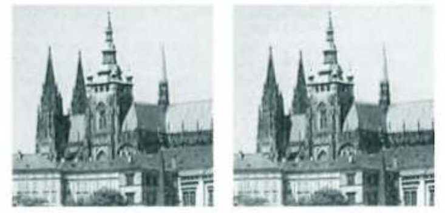

# Računarska vizija
Stefan Nožinić (<stefan@lugons.org>)

---
# tipovi grafika 

---
# Generativna grafika 

* iz podataka generišemo sliku
* Podaci o verteksima 
* podaci o teksturi
* podaci o bojama, osvetljenju itd...
* Projekcija 3D scene na 2D ekran

---
# Računarska vizija 

* iz slike dobijamo podatke
* preprocesiranje slike
* segmentacija
* detekcija oblika
* opis oblika
* kognitivna grafika

---
# Kamera i slika 

---
# foto senzori 

* charge-coupled device
* CMOS: većina kamera koristi ovaj tip senzora
* detektujemo količiu svetlosti pristiglu na senzor i to pretvaramo u napon

---
# obrada signala

* diskretizacija (uzorkovanje)
* kvantovanje

---
# Kvantovanje

---
# Kvantovanje

---
# kako nastaje slika u boji?

* imamo senzor za crvenu, zelenu i plavu boju zasebno
* Matrica slojevitih senzora
* jedan sloj matrice sa različitim tipom senzora u svakoj ćeliji
  + koristimo interpolaciju za dobijanje količine crvene, zelene i plave za dati piksel

---
# Proces uklanjanja šuma unutar kamere

* senzori često detektuju šum
* radi se filtriranje od strane kamere
* Detekcija kamere 

---
# Osnovne osobine slike 

---
# Okolina piksela 

* bitno je kako definišemo okolinu piksela
* 4-okolina
* 8-okolina
* primer dve prave koje se seku u realnosti ali na slici ne zbog diskretizacije

---
# Grayscale slika 

* $$ s = \frac{r+g+b}{3} $$ 

---
# Histogram osvetjenosti

* verovatnoča pojave svake osvetljenosti na slici
* prolazak kroz sliku i brojanje pojedinačnih osvetljenosti čiji broj čuvamo u niz 

---
# Prostori boja 

* svaki piksel možemo predstaviti kao vektor
* svaka komponenta vektora je količina određene boje
* sve boje se dobijaju kombinacijom datih vektora
* ovakvom predstavom dobijamo prostor
* da li možemo u svakom prostoru predstaviti svaku boju?

---
# transformacije nad bojama 

* $$ I'(x,y) = F(I(x,y)) $$

* RGB to grayscale
* RGB to HSV
* HSV to RGB
* CMYK to RGB
* thresholding

---
# Palete 

* čuvamo najčešće boje u tabeli i referenciramo ih u vrednostima piksela radi kompresije

---
# Thresholding 

* binarizacija slike
* multi level thresholding
* optimalan thresholding 

$$ 
I(x,y) = \left\{ 
\begin{matrix}
1 & g(I, x, y) > T\\
0 & otherwise

\end{matrix}
\right.
$$

+ $$ g(i,x,y) = I(x,y) $$
+ $$ g(i,x,y) = I(x,y)e^{-k(x+y)} $$
+ ...

---

---

---
# Optimalan thresholding

---
# Histogram equalization

* izmeniti vrednosti piksela kako bismo dobili ujednačen histogram

---
# Lokacijske transformacije 

---
# Afine transformacije 

* translacija
* rotacija
* skaliranje
* problemi sa deformacijom

---
# Filtriranje i konvolucija 

---
# konvolucija 

$$ I'(x,y) = \sum_{(m,n) \in O} I(i-m, j-n) h(m,n) $$ 

---
# Primeri

* Flitriranje slike 
* detekcija određenih osobina

---
# median filtering 

$$ h(i,j) = \frac{1}{9} $$  

---
# morfološke transformacije

* erozija 
* dilatacija
* otvaranje
* zatvaranje
---
# Detekcija ivica 

---
# Uvod 

* važno je da detektujemo ivice kako bismo videli granice objekata 
* jako korisno kasnije tokom segmentacije

---
# Gradient

$$ G_x(x,y) = I(x+1, y) - I(x,y) $$ 

$$ G_y(x,y) = I(x,y+1) - I(x,y) $$

$$ G(x,y) = \sqrt{G_x^2(x,y) + G_y^2(x,y)} $$ 

---
# Gradient - bolji način

$$ G_x(x,y) = \frac{I(x+1, y) - I(x-1,y)}{2} $$ 

$$ G_y(x,y) = \frac{I(x,y+1) - I(x,y-1)}{2} $$

---
# Detekcija pravih i krivih - Hafova transformacija 

* renemo od jednačine prave 

$$ y = kx + n $$ 

* uzmemo sve piksele iz binarizovan slike koji su vrednosti 1
* za svaku kombinaciju (k,n) brojimo koliko piksela zadovoljava jednačinu
* uzmemo (k,n) za koje je broj lokalni maksimum

---
# Bolji način reprezentacije prave

$$ s = x\cos\theta + y\sin\theta $$ 

---
# detekcija drugih krivih

* isti metod kao sa pravama
* problemi velikog prostora parametara

---
# Segmentacija 

---
# Definisanje regiona 

* ispunjava dva svojstva:
* homogenost:
* $$ H(R_i) = 1 $$ 
* $$ H(R_i \cup R_j) = 0 $$

---
# Region merging 

* krenemo da je svaki piksel region za sebe
* spajamo 2 regiona sve dok druga osobina nije zadovoljena
* završavamo kada ne postoje više dva regiona koja se mogu spojiti

---
# Region splitting 

* krenemo od jednog regiona koji je cela slika
* razdvajamo delove od regiona sve dok osobine nisu zadovoljene

---
# Distance transform 

---
# Opis objekata

---
# Bounding rectangle

* Oko detektovanog objekta pravimo pravougaonik
* najjednostavniji model opisa projekta
* možemo raditi afine transformacije nad pravougaonikom
* mo\emo ga analizirati kao bilo koju drugu sliku 

---
# Konveksni omotač

* za nekonveksne objekte, radi se split

---
# Ivica regiona

* svi pikseli koji pripadaju regionu a za svoju okolinu imaju bar jedan piksel koji ne pripada regionu
---
# Segmentacija zmijom

* ideja je naći krivu (x(t), y(t)) tako da maksimizujemo fitting funkciju f(x(t), y(t))

* fitting funkcija mož biti:
  * lokalna svojstva piksela na krivi 
  * globalna svojstva slike u odnosu na krivu 
  * osobine krive (zakrivljenost)

---
# Segmentacija klasterovanjem

* uradimo transformaciju nad prostorom boja 
* sada za svaki piksel imamo vektor (x,y,A,B,C,...)
* piksele možemo klasterovati algoritmima za klasterizaciju:
  * k-means
  * mean shift clustering
* Primeri transformacija boja
  * RGB to LU
  * RGB to HSV
  * analiza tekstura

---
# Geometrijski deformirajući objekti

* imamo početni oblik koji donekle segmentira sliku
* na osnovu neke heuristike, menjamo oblik krive
* možemo menjati heuristiku i videti rezultate za svaku od njih

---
# Integralne transformacije 

---
# Furijeva transformacija u 2D

---

---

---

---

---

---

# Wavelet transformacije

---
# Redukcija dimenzionalnosti 

---
# Feature extraction 

---
# PCA 

---
# Strukture podataka u računarskoj viziji

---
# Matrice 

---
# Co-occurence matrix 

* $$ C_{i,j} = p(I(x,y) = i | p(I(x,y)) = j) $$

---
# Quadtree 

---
# Integralne slike 

$$ F_{i,j} = \sum_{m=0}^i \sum_{n=0}^j I(m,n) $$ 

---
# Topološki graf 

* uradimo segmentaciju slike na regione
* imamo relaciju nd skupom regiona r
* napravimo graf na osnovu date relacije

---
# Mašinsko učenje

---
# Neuronske mreže 

---
# Konvolucione neuronske mreže

---
# Analiza video snimaka 

---
# Optical flow 

---

# Primeri projekata

* detekcija brendova piva na snimku
* Docuent layout analysis + paper detection
* Loši rezultati - detekcija instrumenata 