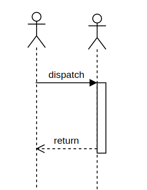

# BlockChain - Uvodno predavanje 

Stefan Nožinić (stefan@lugons.org)

---


---
# Potrebni primitivi 

* P2P mreža 
* content addressability 
* Autentičnost poruke (potpis)
* sprečavanje raznih napada 
* konsenzus

---
# P2P mreža 


---
# RPC 




---
# Content addressability


---
# Heš funkcije 

Osobine heš funkcije H : S -> B gde je B skup nizova fiksne dužine.

+ ulaz može biti bilo koje veličine
+ izlaz je fiksne veličine
+ računanje H(x) je računarski lako i u polinomijalnom vremenu u odnosu na veličinu ulaza
+ za bilo koje h u M, računarski je neizvodljivo izračunati x takvo da H(x) = h
+ za bilo koji blok x, računarski je teško pronaći y != x takvo da H(x) = H(y)
+ računarski je teško pronaći bilo koji par (x,y) takav da H(x) = H(y)

---

osobina 6 štiti od birthday attack-a

ako H zadovoljava prvih 5 osobina, naziva se slabom heš funkcijom

ako zadovoljava svih 6 osobina, naziva se jakom heš funkcijom.

---
#  SHA-512 algoritam

```
function sha512(m):
    old_size = size(m)
    m = m + '1'
    if size(m) % 1024 != 895 then m = pad(m, 0, 895-size(m) % 1024)
    m = m + u128(old_size)
    m1, m2, ..., mN = divide_into_blocks(m, 1024) // mi is 1024-bit block
    MD = init_buffer(512)
    return process([m1, ..., mN])

```


---
# Asimetrična kriptografija 


---


---
# Potpisi i dokaz autentičnosti 


---


---
# RSA algoritam 

---

**Primalac:**

+ generiši 2 različita prosta broja \( p \) i \( q \)
+ neka 
$$ n = pq $$
+ izaberi ceo broj e tako da 
$$ \gcd(e, (p-1)(q-1)) = 1 $$
+ javni ključ je par 
$$(e, n)$$
+ izračunaj d tako da 
$$ ed \equiv 1 \ (\mod \ (p-1)(q-1)) $$
+ privatni ključ je par (d, n)

---

**Enkripcija:** Datu poruku  m, pošiljalac prvo proverava da li je 
$$ \gcd(m, n) = 1 $$
, sada se šifrovana poruka može izračunati kao

$$ m' = \text{rem}(m^e, n) $$


---
**Dekripcija:** Primalac dešifruje poruku koristeći tajni ključ

$$ m = \text{rem}((m')^d, n) $$


---
# Sprečavanje raznih napada

---
# Sybil attack 


--- 
# Proof of work 

```
function proof_of_work(data, k):
    nonce = initial_nonce()
    target = "0" * k  // Niz od k nula

    while true:
        hash_value = H(data || nonce)
        if hash_value.startswith(target):
            return nonce
        nonce = next_nonce(nonce)

function H(x):
    // Implementacija hash funkcije (npr. SHA-256)
    return sha256(x)


```

---
# Motivacija za PoW

* zašto bi neko validirao blokove ako može da se osloni na druge čvorove da rade težak posao?

---
# Bitcoin 

* Proof of work 
* P2P - gossip protocol
* Transakcije mogu da sadrže posebne skript delove
* merkle stabla

---
# Pitanja?

