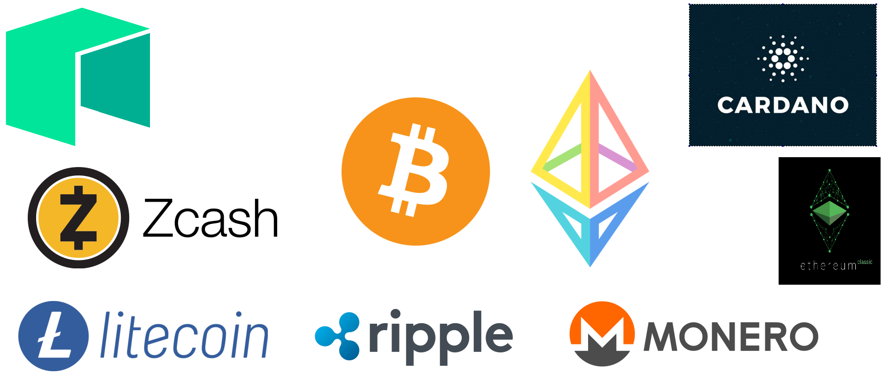

# BlockChain - Uvodno predavanje 

Stefan Nožinić (stefan@lugons.org)

---

---
# P2P mreža 

---
# RPC 

---
# Asimetrična kriptografija 

---

---
# Potpisi i dokaz autentičnosti 

---

---
# Append-only log 

Vreme  | Autor | Podaci
-------|-------|------
15616  |A      | ....
28615  |B      | ....
30160  |C      | ....

---
# Konsenzus 

---
# Byzantine Fault Tolerance

---
# Double spending

Pošaljilac | Primalac | Vrednost | Kusur
------|-----------|-------|-------
A     | B        | $100   | $400
A     | B        | $600   | $1000

---
# Sybil attack 

---
# HashCash 

--- 
# Proof of work 

---
# Transakcija 

Sadrži:

* adresu pošiljaoca
* adresu primaoca
* vreme
* identifikator prethodne transakcije
* dodatne metapodatke u zavisnosti od konkretne implementacije
* podatke (npr, vrednost, kod, ...)
* potpis privatnim ključem pošiljaoca

---
# Ledger

* Transakcijski ledger 
* bilansni ledger

---
# Bilansni ledger

Nalog | Stanje
------|------
A     | $300
B     | $400
C     | $1000

---
Nalog | Stanje
------|------
A     | $0
B     | $400
C     | $1300

---
# Transakcijski ledger

Pošaljilac | Primalac | Vrednost | Kusur
------|-----------|-------|-------
A     | B        | $100   | $400
B     | C        | $100   | $1000
C     | A        | $100   | $0

---
# Blokovi 

---
# Motivacija za PoW

* zašto bi neko validirao blokove ako može da se osloni na druge čvorove da rade težak posao?

---

---
# Čvorovi u mreži

* full nodes
* pruning nodes 
* lightweight nodes 
* miner nodes
* mining pool operators 
* wallets 
* mempool
---
# Konsenzus u prisustvu malicioznih procesa

* Proof of work 
* Proof of stake 
* Proof of authority 
* Proof of burn
* ...

---
# Bitcoin 

* Proof of work 
* P2P - gossip protocol
* Transakcije mogu da sadrže posebne skript delove
* merkle stabla

---
# Pitanja?

