<!-- _class: lead -->
<!-- _paginate: false -->

# Veliki jezički modeli

## od modela u nauci do agenata koji dokazuju teoreme

Stefan Nožinić · stefan@petnica.rs

---

# Plan

1. Šta je **model**?
2. Mašinsko učenje → jezički modeli → **LLM**
3. Transformer i **AlphaFold**
4. Aproksimacija, generalizacija, pristrasnost i varijansa
5. Treniranje i **cena**
6. Kompresija: zašto model zna **manje** od nas
7. **Agenti** i povratna sprega
8. **Navier–Stokes** i Lean
9. Da li je to **inteligencija**?

---

# Šta je model?

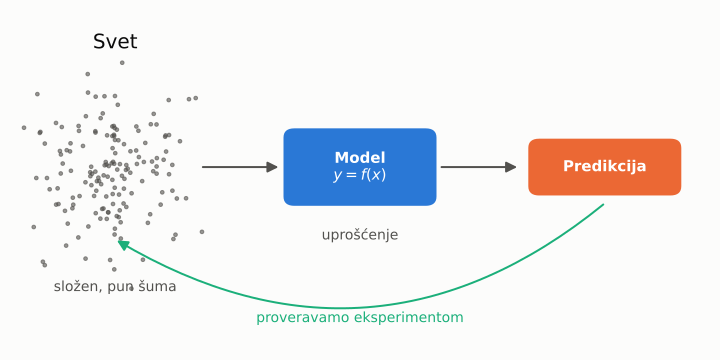

Mapa **nije** teritorija — ali pomaže da se ne izgubimo.

---

# Od zakona do crne kutije

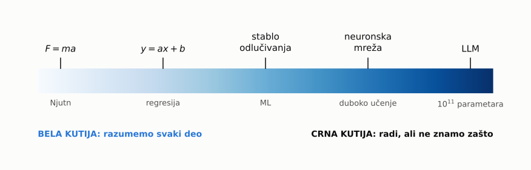

Što je model složeniji, to ga **teže razumemo**.

---

# Mašinsko učenje

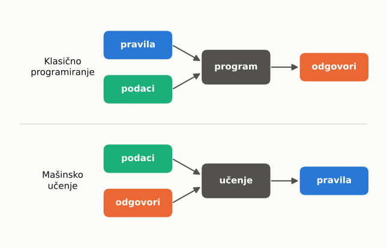

Ne pišemo pravila — **učimo** ih iz primera.

---

# Učenje = smanjivanje greške

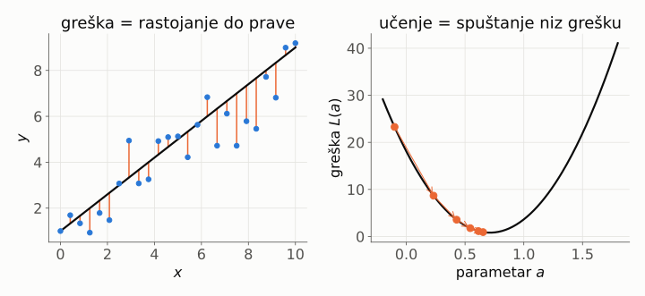

$$
L(a) = \text{prosek}\,\big(y - f(x)\big)^2
$$

---

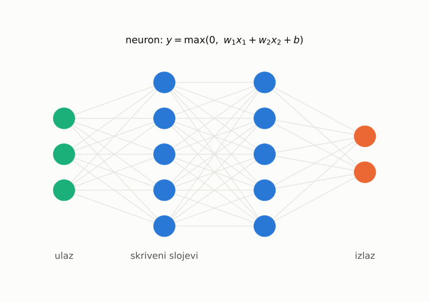

# Neuronska mreža

Mnogo **jednostavnih** delova.

Svaki neuron:
saberi · pomnoži · odseci

Zajedno: **bilo koja** funkcija.

---

# Jezički model

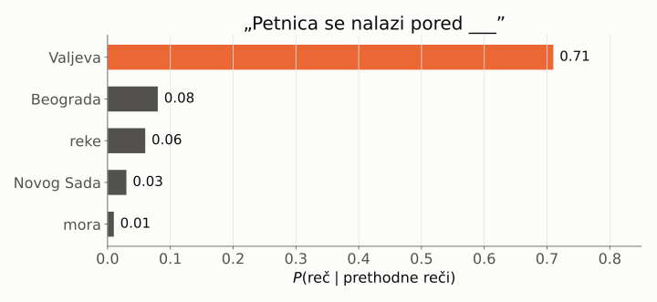

## P( sledeća reč | sve prethodne reči )

---

# Kratka istorija

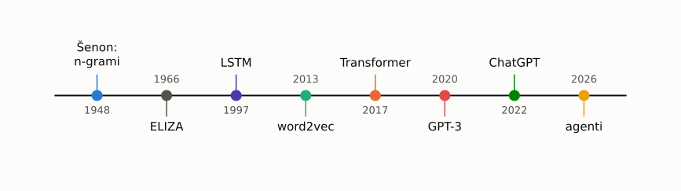

Ista ideja od **1948.** — samo sve više podataka i računanja.

---

# Šta je „veliko” u LLM?

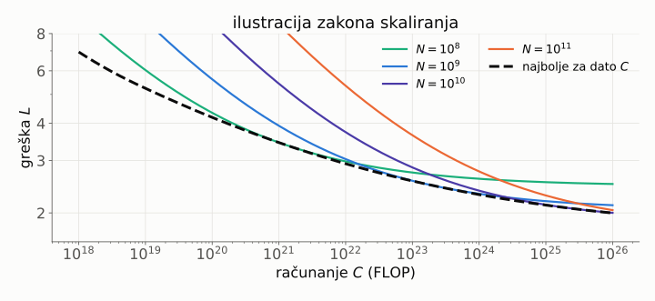

$$
C \approx 6 \cdot N \cdot D \qquad N = \text{parametri},\ D = \text{tokeni}
$$

---

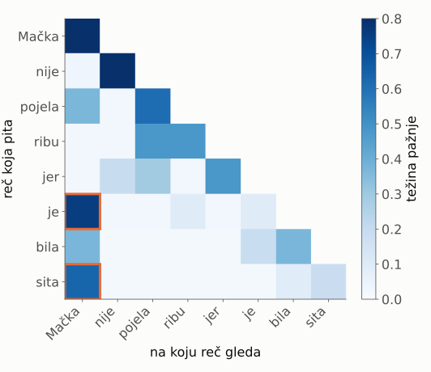

# Pažnja

„Mačka nije pojela ribu jer **je** bila **sita**.”

Ko je sit? Reč **je** gleda na **Mačka**.

$$
\text{izlaz} = \sum_j w_j \cdot v_j
$$

$$
\sum_j w_j = 1
$$

---

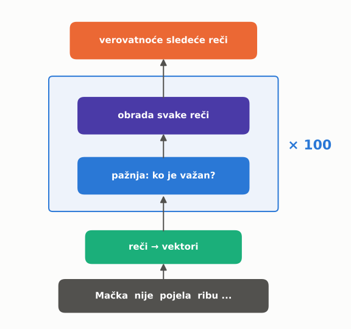

# Transformer

2017: *Attention is all you need*

- pažnja: ko je važan?
- obrada svake reči
- ponovi **~100 puta**
- verovatnoća sledeće reči

Ista arhitektura za tekst, slike, zvuk… i **proteine**.

---

# AlphaFold

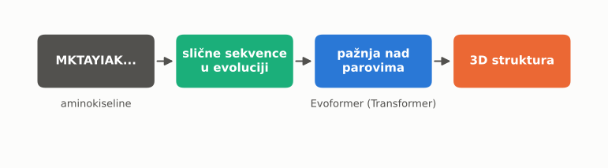

<br>

Isti Transformer — umesto reči, **aminokiseline**.

Nobelova nagrada za hemiju **2024**: Hasabis i Džamper

---

# AlphaFold: od niza do oblika

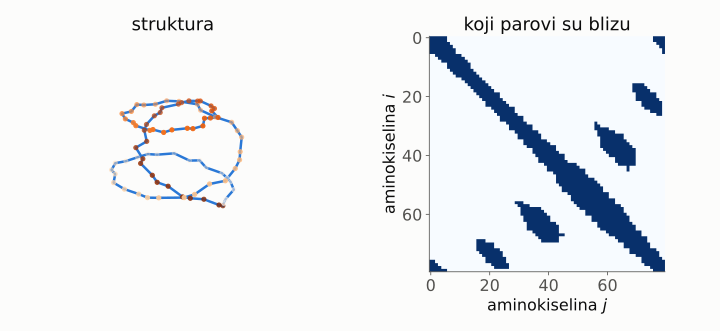

Pažnja pogađa **koji parovi se dodiruju** · baza sa 200+ miliona struktura

---

# Teorija aproksimacije

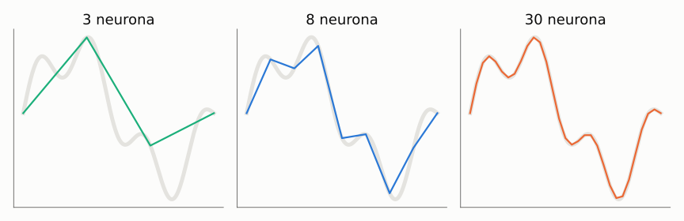

Dovoljno neurona ⇒ **bilo koja** glatka funkcija (Cybenko, 1989)

Ali: *može* da predstavi ≠ *nauči* iz podataka

---

# Generalizacija

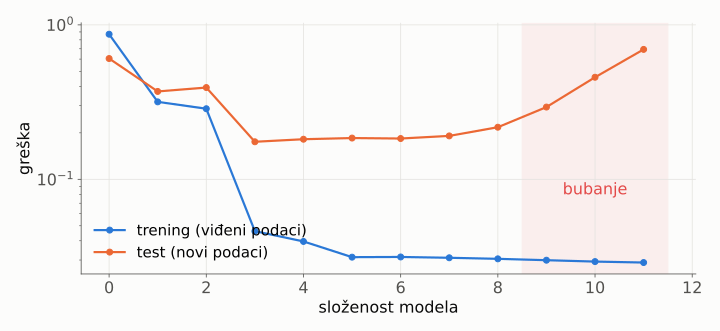

Cilj nije da zapamti primere — nego da radi na **novim**.

---

# Pristrasnost i varijansa

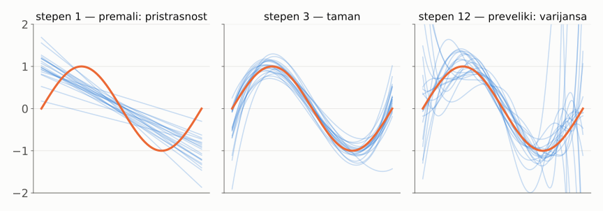

Plave linije: isti model, **20 različitih** skupova podataka.

---

# Kompromis

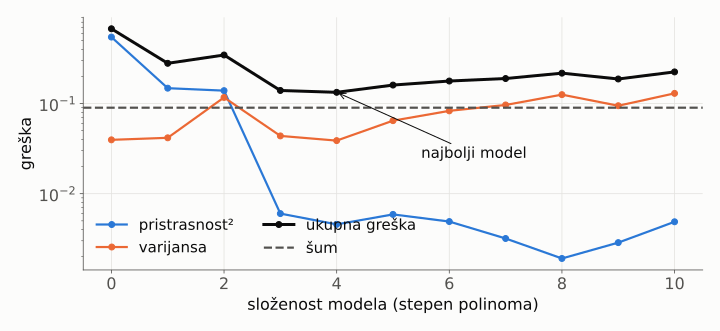

## greška = pristrasnost² + varijansa + šum

---

# Kako se trenira LLM

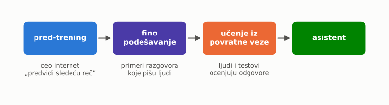

Pred-trening troši **najveći deo** računanja. Ostalo je „vaspitanje”.

---

# Cena računanja

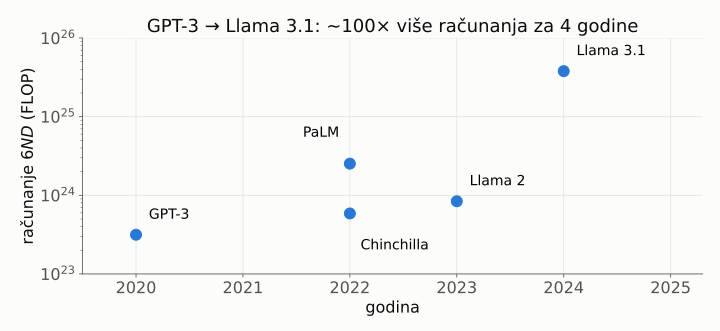

$$
C \approx 6 \cdot N \cdot D \qquad \text{(Llama 3.1: } 6 \cdot 4\cdot10^{11} \cdot 1.6\cdot10^{13} \approx 4 \cdot 10^{25})
$$

---

# Cena u novcu i struji

| | Llama 3.1 405B |
|---|---|
| GPU sati (H100) | 31 milion |
| cena (gruba procena, ~2 $/h) | ~60 miliona $ |
| struja samo za GPU | ~22 GWh |

<br>

GPT-4 (2023): **više od 100 miliona $** · pravilo: ~**20 tokena** po parametru

---

# Model je kompresija

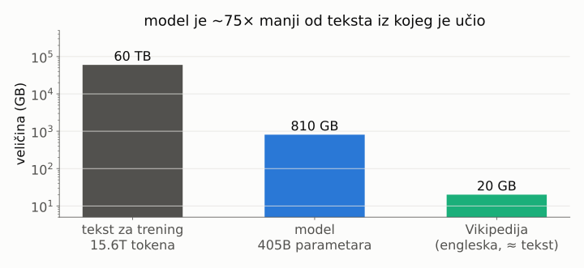

Ne može da zapamti sve — mora da **odbaci** deo.

---

# Nejednakost obrade podataka

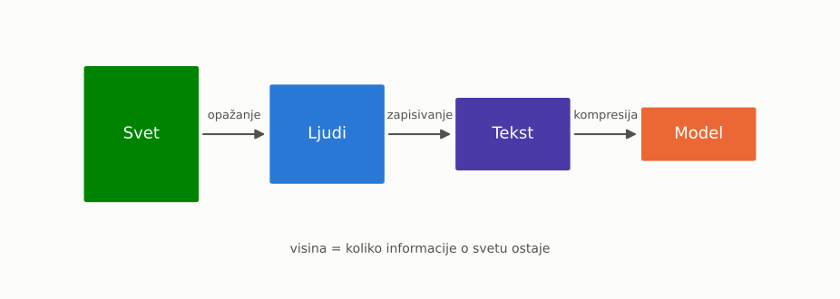

$$
\text{Svet} \to \text{Tekst} \to \text{Model}
\quad\Longrightarrow\quad
I(\text{Svet};\,\text{Model}) \le I(\text{Svet};\,\text{Tekst})
$$

Nijedna obrada ne **stvara** informaciju o svetu.

---

# Šta to znači?

- Model **ne može znati o svetu** više nego što su ljudi zapisali.
- U tom smislu je model uvek **„gluplji” od čoveka**: on uči od nas.
- Kompresija gubi detalje → **halucinacije** popunjavaju rupe.
- Dedukcija **ne dodaje** informaciju — samo otkriva šta već sledi iz aksioma.

<br>

Zato su modeli najjači tamo gde postoji **provera**.

---

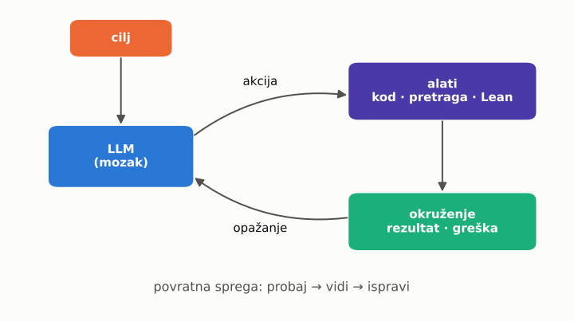

# Agenti

LLM + alati + **povratna sprega**

1. predloži akciju
2. izvrši je
3. pogledaj rezultat
4. ispravi se

Isto kao termostat ili autopilot.

---

# Zašto je provera ključna

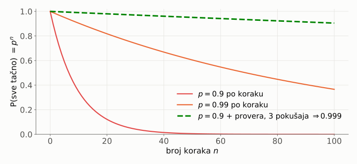

## P(sve tačno) = $p^n$ · $\ 0.9^{50} \approx 0.5\%$

---

# Navier–Stokes jednačina

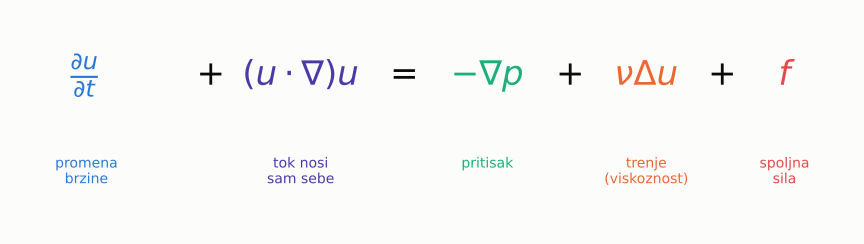

Opisuje vodu, vazduh, vreme, krv…

**Milenijumski problem** (2000): nagrada **1 milion $**

---

# Pitanje: da li tok može da „eksplodira”?

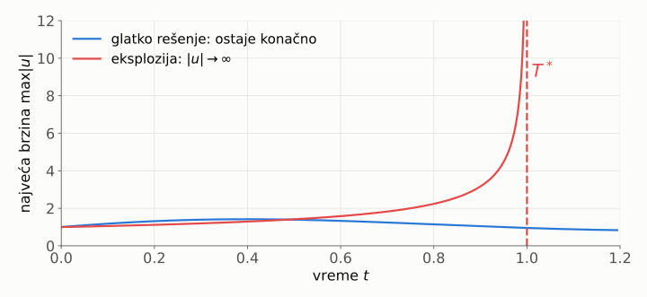

Glatki početak ⇒ **uvek** glatko rešenje?  Ili brzina postane **beskonačna** u konačnom vremenu?

---

# Lean 4: računar proverava dokaz

```lean
theorem dva_plus_dva : 2 + 2 = 4 := by
  norm_num
```

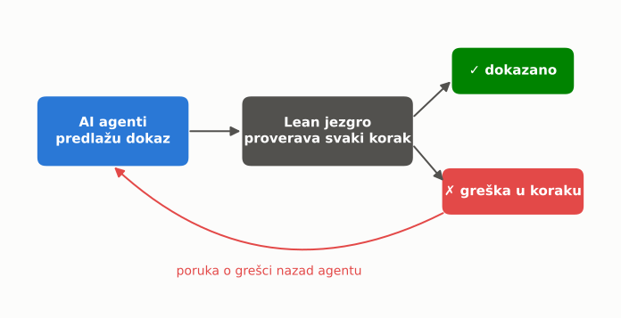

---

# Šta je OpenAI objavio (8. sep 2026)

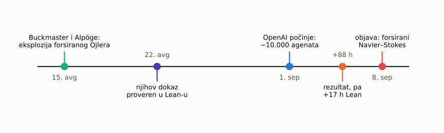

- **kontraprimer**: glatka sila $f$ + glatki početak ⇒ brzina $\to \infty$ u konačnom vremenu
- za $\mathbb{R}^3$ i torus · dokaz formalizovan u **Lean 4**
- ~10.000 agenata · 88 h + 17 h za Lean · nagradu **ne traži**

---

# Oprez

| Tvrdnja | Status |
|---|---|
| forsirani slučaj (iskazi C i D) | objavljen dokaz + Lean |
| **bez sile** (iskazi A i B) | i dalje **otvoren** |
| Lean proverava dokaz | ✓ |
| Lean proverava da je **iskaz** dobro zapisan | ✗ — to moraju ljudi |
| recenzija i Clay institut | još nije |

Spor oko prioriteta: Buckmaster (NYU) i Alpöge (Anthropic), forsirana Ojlerova jednačina.

---

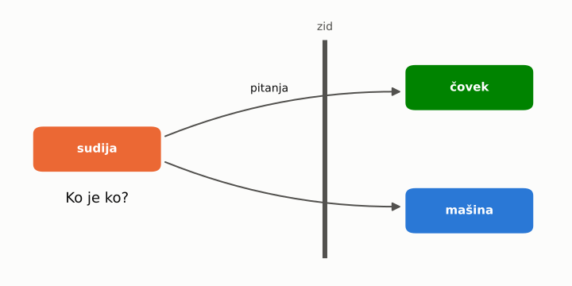

# Tjuringov test

1950: „Mogu li mašine da misle?”

Ako sudija **ne razlikuje** mašinu od čoveka ⇒ mašina „misli”?

Današnji LLM-ovi ga **ne prolaze**.

Test meri **ponašanje**, ne razumevanje.

---

# Zašto AI nije inteligencija

| | Čovek | LLM |
|---|---|---|
| izvor znanja | **svet** | tekst o svetu |
| informacija | opaža novo | $\le$ podaci (DPI) |
| ciljevi | svoji | zadati |
| razumevanje | značenje | statistika simbola |
| dokaz Navier–Stokes | **postavio** problem | pretražio dokaze |

Protivargument: možda je i mozak formalni sistem — **otvoreno pitanje**.

---

# Rezime

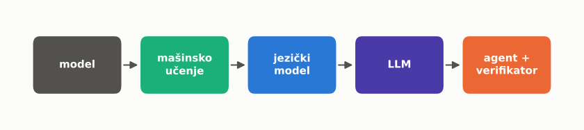

- model = **uprošćenje** sveta
- LLM = **kompresija** teksta ⇒ ne zna više od nas
- snaga dolazi iz **povratne sprege** i **provere** (Lean)
- pristrasnost, varijansa i cena ograničavaju sve modele

---

<!-- _class: lead -->
<!-- _paginate: false -->

# Pitanja?

## Hvala!

---

# Izvori

- OpenAI: *On the Navier–Stokes Millennium Prize Problem* (8. sep 2026)
- Scientific American: *AI may have just solved a million-dollar math problem*
- Kingy AI: *OpenAI's Navier–Stokes Proof Claim: Evidence and Dispute*
- Vaswani et al. (2017): *Attention Is All You Need*
- Jumper et al. (2021): *Highly accurate protein structure prediction with AlphaFold*
- Hoffmann et al. (2022): *Training Compute-Optimal Large Language Models*
- Meta (2024): *Llama 3.1 model card*
