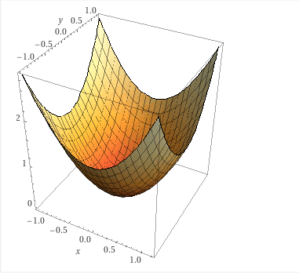

# Sve što ste hteli da znate o M... a niste smeli da pitate

Stefan Nožinić <stefan@lugons.org>

--- 

# Zašto ova prezentacija?

* Predavanja koja ćete imati kasnije
* Formalizmi su važni za poznavanje teorije
* Korisno kasnije u radu
    * Na primer, na petničkim projektima

---
# Osnovne strukture i koncepti

* Skupovi 
$$ A = \{1,2,3\} $$
$$ N = \{ 1,2,3, ... \} $$

* Isto jako poznat skup: $\mathbb{R}$ 

---
# Operacije nad skupovvima 

* unija 
* presek 
* Razlika 
* proizvod

--- 
# Proizvod dva skupa 

$$ A = \{1,2,3\} $$ 

$$ B = \{a,b,c\} $$ 

$$ A \times B = \{(1,a), (1,b), ... (3,c)\} $$ 

---
# Proizvod skupa realnih brojeva

$$ \mathbb{R} \times \mathbb{R} = \mathbb{R}^2 = \{(0,0), (0,0.0001), ..., (\sqrt{2}, \sqrt{3}), ...\}$$

* Predstavlja sve tačke na dekartovom koordinatnom sistemu

--- 
# Kako bismo predstavili sve tačke u 3D prostoru?

---

$$ \mathbb{R} \times \mathbb{R}^2 = \mathbb{R}^3 $$ 

---
# Vektori i vektorski prostori

* $\mathbb{R}^2$ je skup svih tačaka, odnosno vektora u 2D prostoru
* Da li moramo da se ograničimo samo na realne brojeve?

---
# Množenje vektora skalarom

$$ k \cdot (x,y) = (kx, ky) $$ 

---
# Sabiranje vektora 

$$ (x,y) + (u,v) = (x+u, y+v) $$ 

---
# Da li je $\mathbb{R}^n$ vektorski prostor? 

---
# Bazni vektori 

* kako vektor (7,5) možemo predstaviti?
* $7 \cdot (1,0) + 5\cdot (0,1)$

---
# Bazni vektori

* Svaki vektor možemo predstaviti kao linearnu kombinaciju:

$$ v = \alpha_1 b_1 + \alpha_2 b_2 + ... + \alpha_n b_n = \sum_{i=1}^N \alpha_i b_i $$ 

gde su $\alpha_1, ..., \alpha_n$ neki brojevi (videćemo kasnije i koji) a $b_1, b_2, ..., b_n$ su bazni vektori

---
# Primer za 2D

$$ (2,3) = 2 \cdot (1,0) + 3 \cdot (0,1) $$ 

* šta su skalari ovde? 
* šta su bazni vektori?

---
# Skalarni proizvod vektora

$$ (1,5) \cdot (2,4) = 1\cdot 2 + 5\cdot 4 = 22 $$ 

Generalno 

$$ (x_1, ..., x_n) \cdot (y_1, ..., y_n) = x_1y_1 + ... + x_n y_n = \sum_{i=1}^n x_iy_i $$ 

---
# Matrice

* Način da promenimo/transformišemo bazne vektore!

---
# Primer matrice koja vrši transformaciju u 2D prostoru

$$A = 
\begin{bmatrix}
1 & 2 \\
3 & 4 
\end{bmatrix}
$$

* $v = (10, 20)$

$$Av = 
\begin{bmatrix}
1 & 2 \\
3 & 4 
\end{bmatrix}
\cdot 
\begin{bmatrix}
10 \\
20 
\end{bmatrix}
 = 
 \begin{bmatrix}
1\cdot 10 + 2 \cdot 20 \\
3\cdot 10 + 4 \cdot 20 
\end{bmatrix}
=
 \begin{bmatrix}
50 \\
110 
\end{bmatrix}
$$

---
# Primer matrice koja vrši transformaciju u 2D prostoru

$$I = 
\begin{bmatrix}
1 & 0 \\
0 & 1 
\end{bmatrix}
$$

* $v = (10, 20)$

$$Iv = 
\begin{bmatrix}
1 & 0 \\
0 & 1 
\end{bmatrix}
\cdot 
\begin{bmatrix}
10 \\
20 
\end{bmatrix}
 = ?
$$

---
# Množenje matrica

$$AB = 
\begin{bmatrix}
2 & 5 \\
1 & 3 
\end{bmatrix}
\cdot 
\begin{bmatrix}
2 & 3 \\
2 & 7 
\end{bmatrix}
 = ?
$$

---
# Koliko je ovo?

$$ 
\begin{bmatrix}
1 & 0 \\
0 & 1 
\end{bmatrix}
\cdot 
\begin{bmatrix}
2 & 3 \\
2 & 7 
\end{bmatrix}
 = ?
$$

---
# A ovo?

$$ 
\begin{bmatrix}
1 & 1 \\
0 & 1 
\end{bmatrix}
\cdot 
\begin{bmatrix}
1 & -1 \\
0 & 1 
\end{bmatrix}
 = ?
$$

 ---
 # Inverzna matrica

* Matrica takva da je $A \cdot A^{-1} = I$
* Za datu matricu A, ne mora da postoji inverzna matrica 
* Kako se pronalazi inverzna matrica? Postoje algoritmi koje nećemo pokriti ovde

---
# Skalarni proizvod vektora

$$vu = 
\begin{bmatrix}
v_x \\
v_y 
\end{bmatrix}
\cdot 
\begin{bmatrix}
u_x \\
u_y 
\end{bmatrix}
 = v_x\cdot u_x + v_y \cdot u_y
 $$ 

 isto kao da smo rekli 

$$vu = 
\begin{bmatrix}
v_x  & v_y 
\end{bmatrix}
\cdot 
\begin{bmatrix}
u_x \\
u_y 
\end{bmatrix}
 = v_x\cdot u_x + v_y \cdot u_y
 $$ 

---
# Suma sumarum posle pauze :)

* vektori i vektorski prostori
* baza vektorskog postora
* matrice
* jedinična matrica 
* inverzna matrica
* skalarni proizvod 

---
# Funkcije 

* Preslikavanje $f : A \to B$
* mi ćemo se baviti najviše realnim funkcijama gde je $A = \mathbb{R^n}$ a $B = \mathbb{R^m}$

---
# Funkcije jedne promenljive 

$$ f : \mathbb{R} \to \mathbb{R} $$

* na primer $f(x) = x^2$

---
# Šta nam je interesantno kod funkcija?

* traženje x takvo da je funkcija maksimalna ili minimalna 

---
# Slikoviti primer

---
# Formalno

koeficijent tangente ja grafiku u tački $x_0$:

$$ k = \frac{f(x + h) - f(x)}{h} $$ 

---
# Primer

$$ f(x) = x^2 $$

$$ k = \frac{(x+h)^2 - x^2}{h} = \frac{x^2 + 2hx + h^2 - x^2}{h} = \frac{2hx + h^2}{h} = 2x + h $$

kada je h jaaaako malo onda je 

$$ k = 2x $$ 

za koje x je k=0?

---
# Primer

$$ f(x) = ax^2 + bx + c $$ 

$$ k = \frac{ax^2 + 2axh + ah^2 + bx + bh + c - ax^2 - bx - c}{h} = 2ax + ah + b $$ 

ako je h jaaaako malo onda je 

$$ k = 2ax + b $$

---
# Još formalnije

* k je zapravo izvod funkcije 
* izvod  se obeležava na više načina:
    * $f'(x)$
    * $\frac{d}{dx}f(x)$
    * $\frac{df}{dx}$

---
# Funkcija više promenljivih 

$$ f(x,y) = x^2 + y^2 $$ 

sada nemamo tangentnu pravu nego ravan 

---
# Tangentna ravan 

* pravu opsijemo sa jednačinom $p(x) = kx + n$
* Ravan opisujemo sa $\alpha (x,y) = ax + by + c$
* Dakle, računamo a,b 

$$ a = \frac{f(x+h, y) - f(x,y)}{h} $$ 

$$ b = \frac{f(x,y+h) - f(x,y)}{h} $$ 

---
# Traženje minimuma i maksimuma funkcije više promenljivih

treba da nam a = 0 i b = 0

---
# Primer

$$ f(x,y) = x^2 + y^2 $$

$$ a = \frac{(x+h)^2 + y^2 - x^2 - y^2}{h} = \frac{x^2 + 2hx + h^2 + y^2 - x^2 - y^2}{h} = 2x + h $$ 

kada je h jaaaako malo onda je $a = 2x$ 

$$ b = ? $$

---

$$ a = 2x $$ 

$$ b = xy $$ 

ova dva možemo zapisati kao:

$$ \nabla f = (2x, 2y) $$ 

$\nabla f$ se naziva gradient funkcije f 

---
# Funkcije mnooogo promenljivih

* po istom principu
* $f(x_1, x_2, ..., x_n)$
* tražimo parametre za $\nabla f$ 

$$ \nabla f = 
\begin{bmatrix}
\frac{\partial f}{\partial x_1} \\
\frac{\partial f}{\partial x_2} \\
... \\
\frac{\partial f}{\partial x_n} \\
\end{bmatrix}
$$ 

---
# Aproksimacija funkcija 

ako je 

$$ \frac{df}{dx} = \frac{f(x+h) - f(x)}{h} $$ 

izrazimo $f(x+h)$

---

$$ f(x+h) = f(x) + h \frac{df}{dx} $$ 

**Ako  znamo $f(x)$ i njen izvod u toj tački, možemo izračunati koliko je vrednost funkcije u blizini te tačke**

---
# Kako tražimo numerički minimum funkcije više promenljivih?

Pokazano je da ako imamo funkciju f i ako se nalazimo u nekoj tački x0, da je njen minimum u pravcu gradient vektora:

$$ x_{n+1} = x_n - \mu \nabla f(x_n) $$ 

---
# Primer

* $f(x,y) = x^2 + y^2$ 
* $\nabla f = (2x, 2y)$ 
* $\mu = 1/2$
* krenemo od $x_0 = (10, 10)$
* $\nabla f (10, 10) = (20, 20)$
* $x_1 = (10, 10) - 1/2 \cdot (20, 20) = (0, 0)$
* $x_2 = (0, 0) - 1/2 \cdot (0,0) = (0,0)$
* kraj 

---
# Sažeto 

* Imamo funkcije jedne i više promenljivih
* minimum  / maksimum tražimo uz pomoć izvoda funkcija 
* postoji relativno jednostavan algoritam za traženje minimuma / maksimuma 

---
# Za kraj 

* postoji cela jedna oblast računarstva koja se bavi numeričkim optimizacijama 
* Primene ovoga svega iznetog:
    * Mašinsko učenje 
    * Računarska grafika 
    * Optimizacioni algoritmi
    * Numeričke simulacije

---
# Literatura 

* G. Strang - Calculus
* G. Strang - Introduction to linear algebra
* E. Kreyszig - Advanced engineering mathematics
* I. Milošević - Vektorski prostori i elementi vektorske analize
* J. Shurman - Multivariable calculus