<!-- _class: lead -->
<!-- _paginate: false -->

# Naučni metod

## od slučajnosti do teorije

Stefan Nožinić · stefan@petnica.rs

---

<!-- _class: center -->

# Da li je quicksort brz?

<br>

## Kako to **znamo**?

---

# Plan

1. Naučni metod
2. Jezik slučajnosti
3. Merenja i testovi
4. Slučajni algoritmi
5. Istraživanje: **Quicksort**
6. Istraživanje: **slučajni grafovi**
7. Od rezultata do teorije

---

<!-- _class: lead -->

# I
# Naučni metod

---

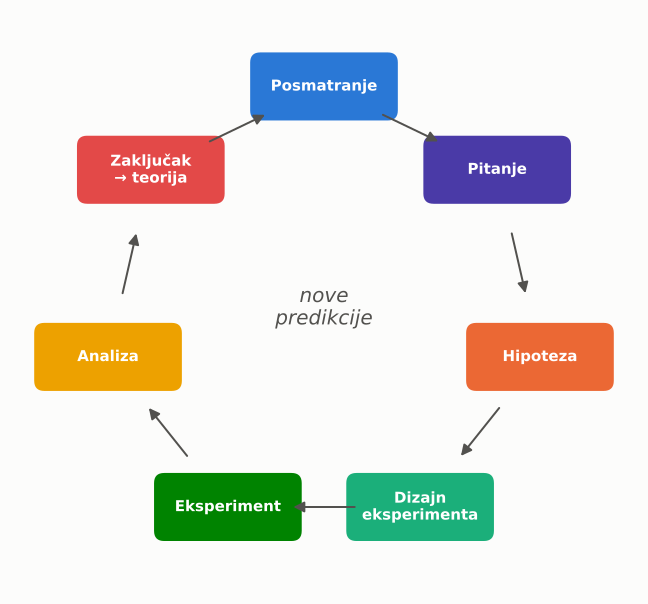

# Ciklus

- posmatramo
- pitamo
- predviđamo
- proveravamo
- zaključujemo

Svaki krug daje **nova pitanja**.

---

# Posmatranje → pitanje

<br>

> „Quicksort je nekad brz, a nekad spor.”

<br>

## Koliko poređenja $C_n$ pravi quicksort nad $n$ elemenata?

<br>

Dobro pitanje je **merljivo**.

---

# Hipoteza

Tvrdnja koja **može da bude netačna**.

<br>

| Loše | Dobro |
|---|---|
| „Quicksort je dobar.” | $E[C_n] \le 2n\ln n$ |
| „Grafovi su povezani.” | $np > 1 \Rightarrow$ postoji džinovska komponenta |
| „Lek pomaže.” | $\mu_{\text{lek}} < \mu_{\text{placebo}}$ |

---

# Falsifikabilnost

$$
H:\quad \forall x \; \big(\text{labud}(x) \Rightarrow \text{beo}(x)\big)
$$

<br>

Hiljadu belih labudova **ne dokazuje** $H$.

<br>

$$
\exists x \; \big(\text{labud}(x) \wedge \neg\,\text{beo}(x)\big) \;\Rightarrow\; \neg H
$$

Jedan crni labud je **obara**.

---

# Nulta i alternativna hipoteza

<br>

$$
H_0:\ \mu_A = \mu_B \qquad\text{„nema efekta”}
$$

$$
H_1:\ \mu_A \neq \mu_B \qquad\text{„ima efekta”}
$$

<br>

Pokušavamo da **odbacimo** $H_0$.

---

# Eksperimentalni dizajn

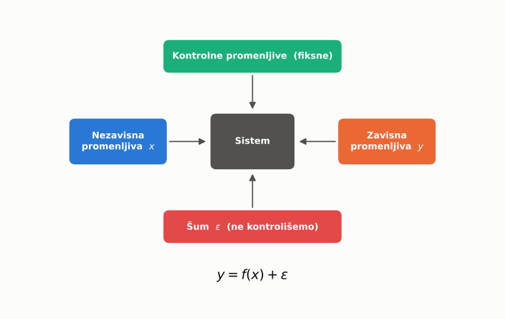

---

# Kontrola i randomizacija

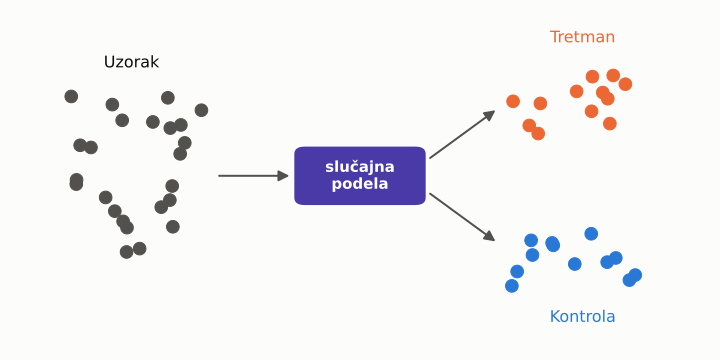

| Kontrola | Randomizacija | Ponavljanje |
|---|---|---|
| sa čim poredimo | uklanja pristrasnost | smanjuje šum |

---

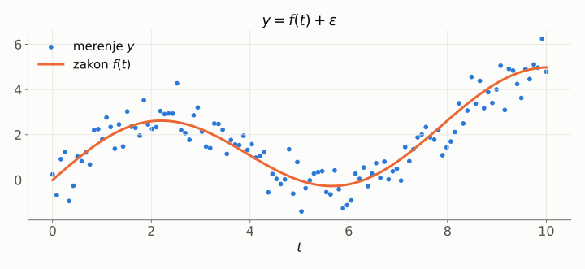

# Eksperiment

Merenje nikad nije savršeno.

$$
y = f(x) + \varepsilon
$$

- $f$ — zakon koji tražimo
- $\varepsilon$ — šum

---

# Tačnost i preciznost

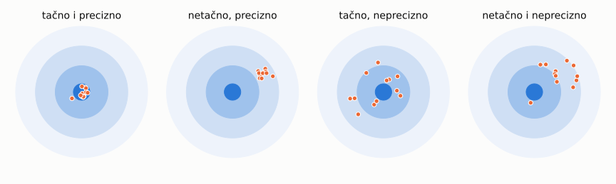

$$
y = f(x) + b + \varepsilon
$$

$b$ — sistematska greška, $\varepsilon$ — slučajna greška


Da bismo razumeli $\varepsilon$ treba nam **jezik slučajnosti**.

---

<!-- _class: lead -->

# II
# Jezik slučajnosti

---

# Slučajna promenljiva

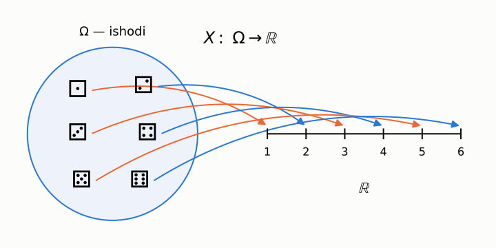

$$
P(X = k) \ge 0, \qquad \sum_k P(X = k) = 1
$$

---

# Neprekidna promenljiva

<br>

$$
P(a \le X \le b) = \int_a^b f(x)\,dx
$$

<br>

$$
F(x) = P(X \le x) = \int_{-\infty}^{x} f(t)\,dt
$$

<br>

$f$ — gustina, $F$ — funkcija raspodele

---

# Očekivanje i varijansa

$$
E[X] = \sum_k k\,P(X=k) \qquad E[X] = \int x\,f(x)\,dx
$$

$$
\mathrm{Var}(X) = E\big[(X - E[X])^2\big], \qquad \sigma = \sqrt{\mathrm{Var}(X)}
$$

<br>

**Linearnost** — važi uvek, čak i za zavisne:

$$
E[X + Y] = E[X] + E[Y]
$$

---

# Uniformna raspodela

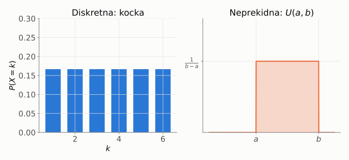

$$
X \sim U(a,b): \quad E[X] = \frac{a+b}{2}, \qquad \mathrm{Var}(X) = \frac{(b-a)^2}{12}
$$

---

# Zakon velikih brojeva

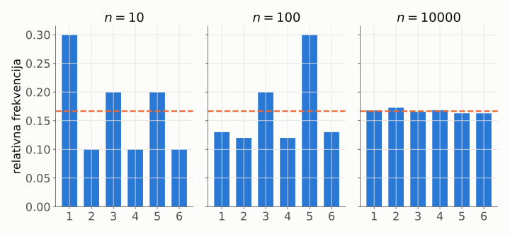

$$
\bar X_n = \frac{1}{n}\sum_{i=1}^n X_i \;\xrightarrow{\;n\to\infty\;}\; E[X]
$$

---

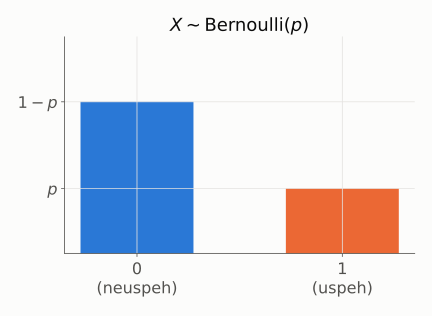

# Binarna raspodela

Jedan pokušaj: uspeh ili neuspeh.

$$
P(X=1) = p
$$

$$
P(X=0) = 1-p
$$

$$
E[X] = p, \quad \mathrm{Var}(X) = p(1-p)
$$

---

# Indikator promenljiva

$$
I_A =
\begin{cases}
1, & \text{desio se } A \\
0, & \text{u suprotnom}
\end{cases}
$$

<br>

$$
\boxed{\,E[I_A] = P(A)\,}
$$

<br>

Brojanje $=$ zbir indikatora. Ovo ćemo koristiti za **quicksort**.

---

# Binomna raspodela

$n$ nezavisnih binarnih pokušaja:

$$
X = \sum_{i=1}^{n} X_i, \qquad X_i \sim \mathrm{Bernoulli}(p)
$$

$$
P(X = k) = \binom{n}{k} p^k (1-p)^{n-k}
$$

$$
E[X] = np, \qquad \mathrm{Var}(X) = np(1-p)
$$

---

# Binomna raspodela

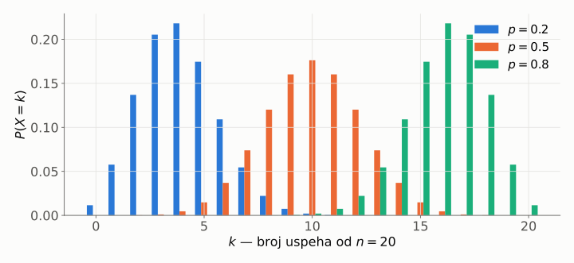

---

# Galtonova tabla

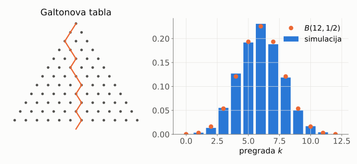

Levo ili desno, 12 puta: $k \sim B(12, \tfrac12)$

---

# Normalna raspodela

$$
f(x) = \frac{1}{\sigma\sqrt{2\pi}}\; e^{-\frac{(x-\mu)^2}{2\sigma^2}}
$$

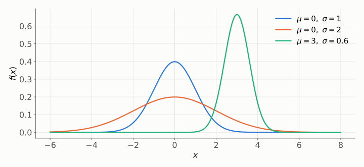

---

# Pravilo 68 – 95 – 99.7

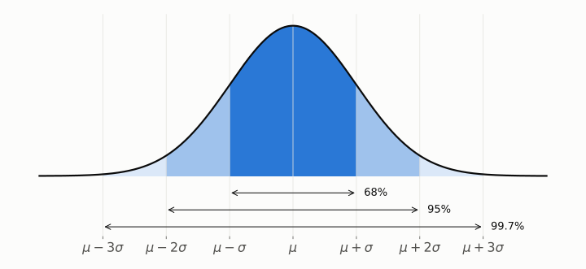

$$
P(|X - \mu| \le 2\sigma) \approx 0.95
$$

---

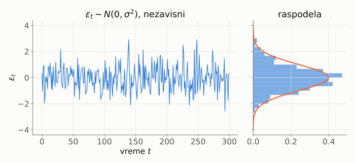

# Beli šum

$$
E[\varepsilon_t] = 0
$$

$$
\mathrm{Var}(\varepsilon_t) = \sigma^2
$$

$$
\mathrm{Cov}(\varepsilon_t, \varepsilon_s) = 0,\ t \ne s
$$

Prošlost ne govori ništa o budućnosti.

---

# Beli šum ili ne?

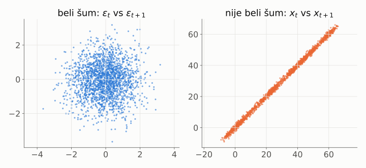

$$
x_{t+1} = x_t + \varepsilon_t
$$

Slučajni hod **ima memoriju**.

---

# Centralna granična teorema

<br>

$X_1, \dots, X_n$ nezavisne, iste raspodele, $E[X_i]=\mu$, $\mathrm{Var}(X_i)=\sigma^2$:

<br>

$$
\boxed{\;\frac{\bar X_n - \mu}{\sigma / \sqrt{n}} \;\xrightarrow{\;d\;}\; N(0, 1)\;}
$$

<br>

Bez obzira na **originalnu** raspodelu!

---

# CGT: prosek eksponencijalnih

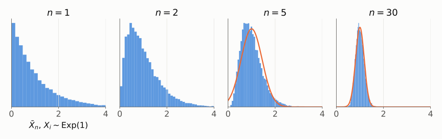

Krivo → simetrično → normalno

---

# CGT: zbir kockica

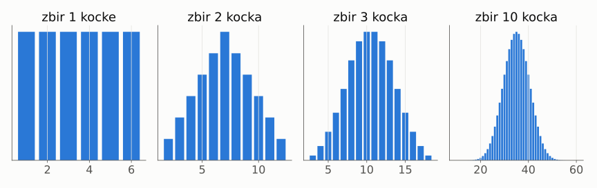

$$
\varepsilon = \delta_1 + \delta_2 + \dots + \delta_m \;\Rightarrow\; \varepsilon \approx N(0, \sigma^2)
$$

Šum je zbir mnogo malih uzroka — zato je **normalan**.

---

<!-- _class: lead -->

# III
# Merenja i testovi

---

# Standardna greška

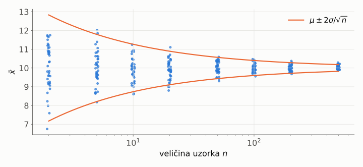

$$
SE(\bar x) = \frac{\sigma}{\sqrt{n}}
$$

4× više merenja ⇒ 2× preciznije

---

# Koliko ponavljanja?

<br>

Želimo grešku najviše $\Delta$ sa sigurnošću 95%:

<br>

$$
1.96\,\frac{\sigma}{\sqrt{n}} \le \Delta
\quad\Longrightarrow\quad
n \ge \left(\frac{1.96\,\sigma}{\Delta}\right)^2
$$

<br>

$\sigma = 2,\ \Delta = 0.5 \;\Rightarrow\; n \ge 62$

---

# Interval poverenja

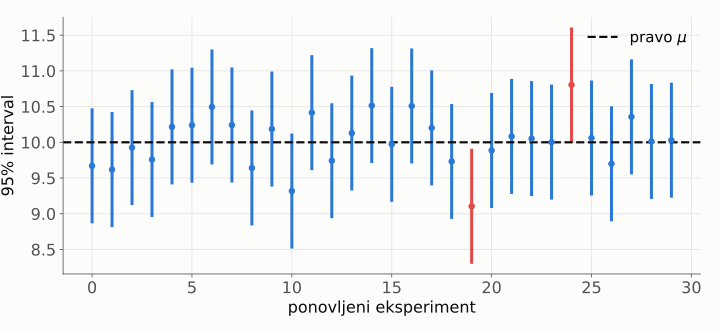

$$
\bar x \pm 1.96\,\frac{s}{\sqrt{n}} \qquad \text{pogodi } \mu \text{ u } \approx 95\% \text{ eksperimenata}
$$

---

# Test hipoteze

<br>

1. postavi $H_0$ i $H_1$
2. izaberi prag $\alpha$ (npr. $0.05$)
3. izračunaj statistiku iz podataka
4. izračunaj $p$-vrednost
5. $p < \alpha \Rightarrow$ odbaci $H_0$

---

# t-test

Jedan uzorak:

$$
t = \frac{\bar x - \mu_0}{s / \sqrt{n}}
$$

Dva uzorka (Welch):

$$
t = \frac{\bar x_A - \bar x_B}{\sqrt{\dfrac{s_A^2}{n_A} + \dfrac{s_B^2}{n_B}}}
$$

**signal / šum**

---

# p-vrednost

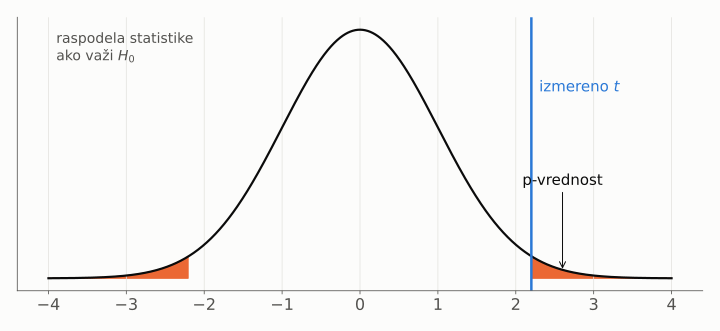

$$
p = P\big(|T| \ge |t| \;\big|\; H_0\big)
$$

---

# Greške I i II vrste

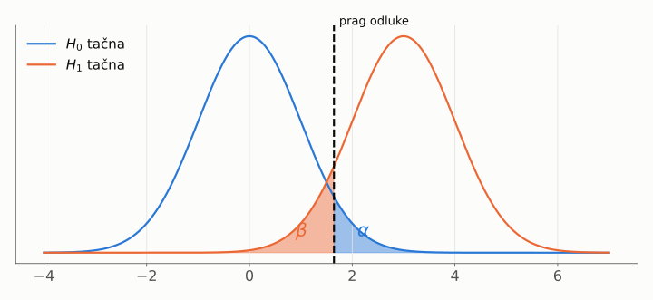

| | $H_0$ tačna | $H_0$ netačna |
|---|---|---|
| odbacimo $H_0$ | greška I vrste $(\alpha)$ | ✓ moć $1-\beta$ |
| ne odbacimo | ✓ | greška II vrste $(\beta)$ |

---

# Zamka: mnogo testova

Test $m$ nezavisnih hipoteza, sve $H_0$ tačne:

Verovatnoća bar jednog lažnog otkrića:

$$
1 - (1-\alpha)^m
$$

<br>

| $m$ | 1 | 5 | 20 | 100 |
|---|---|---|---|---|
| verovatnoća | 5% | 23% | 64% | 99% |

<br>

Bonferoni: koristi $\alpha / m$

---

<!-- _class: lead -->

# IV
# Slučajni algoritmi

---

# Algoritam koji baca kockicu

$$
A(x) \qquad\longrightarrow\qquad A(x, r), \quad r \sim U
$$

<br>

| | Las Vegas | Monte Carlo |
|---|---|---|
| rezultat | uvek tačan | tačan sa verovatnoćom |
| vreme | slučajno | ograničeno |
| primer | quicksort | procena $\pi$ |

<br>

Analiza: **indikatori** + **linearnost očekivanja**

---

# Monte Carlo: procena $\pi$

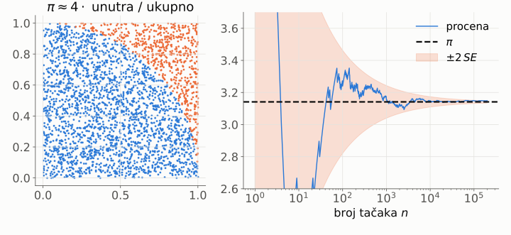

$$
\hat\pi = \frac{4}{n}\sum_{i=1}^{n} I\big(x_i^2 + y_i^2 \le 1\big),
\qquad SE = 4\sqrt{\frac{p(1-p)}{n}},\ p = \tfrac{\pi}{4}
$$

---

<!-- _class: lead -->

# V
# Istraživanje: Quicksort

---

# Algoritam

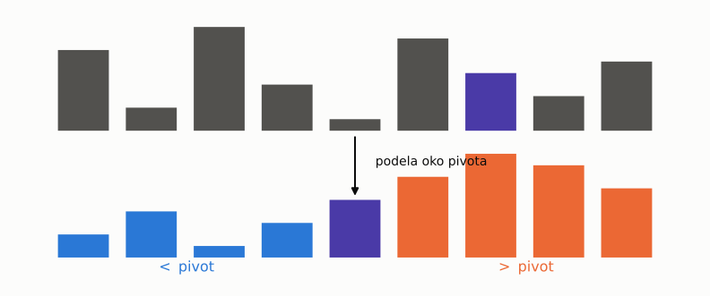

```text
quicksort(S):
    y ← slučajan element iz S
    S₁ ← {s < y},  S₂ ← {s > y}      # |S| − 1 poređenja
    return quicksort(S₁) + [y] + quicksort(S₂)
```

---

# Pitanje i hipoteze

<br>

$$
\underbrace{\;\sim n \log_2 n\;}_{\text{najbolji}} \;\le\; C_n \;\le\; \underbrace{\;\binom{n}{2}\;}_{\text{najgori}}
$$

<br>

$H_1$: slučajan pivot $\;\Rightarrow\; E[C_n] \approx c \cdot n \ln n$

$H_2$: prvi element kao pivot, sortiran ulaz $\;\Rightarrow\; C_n = \Theta(n^2)$

---

# Dizajn eksperimenta

| | |
|---|---|
| nezavisne | $n$, izbor pivota, tip ulaza |
| zavisna | broj poređenja $C_n$ |
| kontrolne | isti kod, isti generator, fiksiran seed |
| ponavljanja | 30 po svakom $n$ |
| $n$ | $10^2 \dots 2 \cdot 10^4$ |

<br>

Zašto ne vreme? $\quad T = c \cdot C_n + \varepsilon$ — keš, OS, CPU

---

# Rezultati

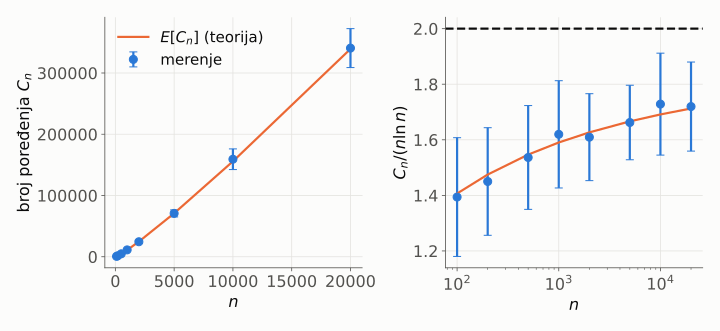

Merenja prate teoriju, ali $C_n / (n \ln n)$ sporo raste ka $2$.

---

# Raspodela $C_n$

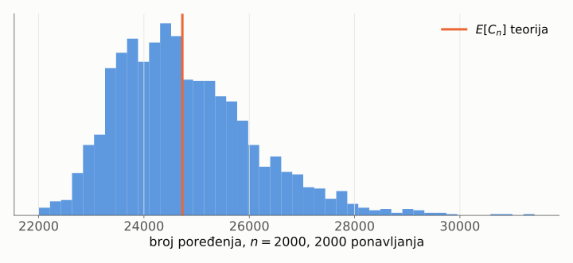

Nije simetrična — $C_n$ **nije** zbir nezavisnih promenljivih.

---

# Log-log grafik

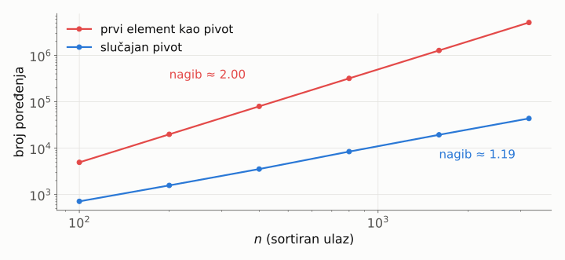

$$
C = a\,n^k \;\Longrightarrow\; \log C = \log a + k \log n
$$

$H_2$ **potvrđena**: nagib $2$.

---

# Teorija: indikatori

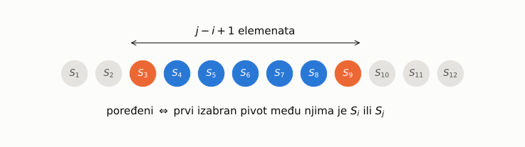

$$
X_{ij} = I(S_i \leftrightarrow S_j), \qquad
P(X_{ij} = 1) = \frac{2}{j - i + 1}
$$

---

# Teorija: izvođenje

$$
E[C_n] = E\Big[\sum_{i<j} X_{ij}\Big] = \sum_{i<j} E[X_{ij}] = \sum_{i<j} \frac{2}{j-i+1}
$$

<br>

$$
= 2(n+1)H_n - 4n, \qquad H_n = \sum_{k=1}^{n} \frac{1}{k} \approx \ln n
$$

<br>

$$
E[C_n] \approx 2n\ln n - 2.85\,n
$$

---

# Zaključak eksperimenta

<br>

| | Eksperiment | Teorija |
|---|---|---|
| rast | nagib $\approx 1.1$–$1.2$ | $n \ln n$ |
| konstanta | $C_n/(n\ln n) \to 1.7$ | $\to 2$, ali sporo |
| sortiran ulaz | nagib $2.00$ | $\binom n2$ |

<br>

Razlika $1.7$ vs $2$? Član $-2.85\,n$ — teorija **objašnjava** i odstupanje.

---

<!-- _class: lead -->

# VI
# Istraživanje: slučajni grafovi

---

# Erdős–Rényi graf $G(n, p)$

Svaka ivica postoji nezavisno sa verovatnoćom $p$.

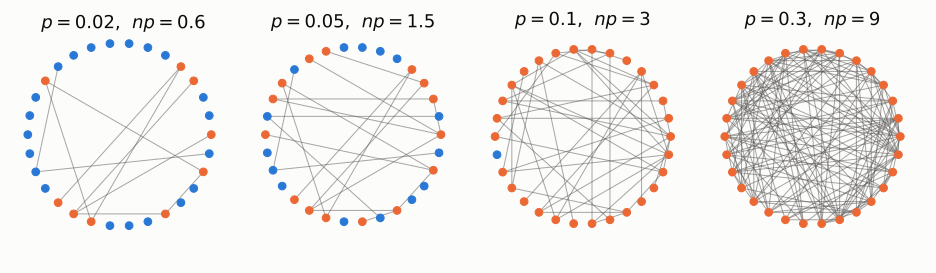

$$
|E| \sim B\Big(\tbinom{n}{2},\, p\Big)
$$

---

# Stepen čvora

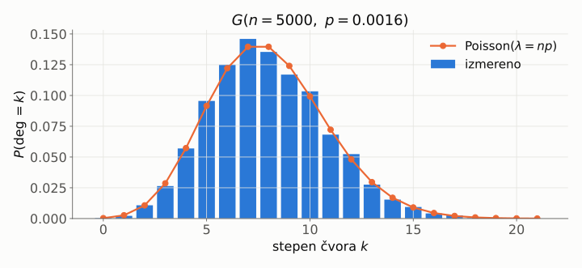

$$
\deg(v) \sim B(n-1,\ p) \;\xrightarrow{\;n\to\infty,\ np=\lambda\;}\; \mathrm{Poisson}(\lambda)
$$

---

# Hipoteza: džinovska komponenta

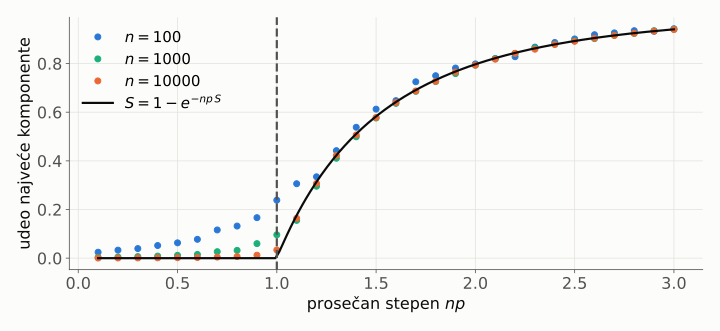

$$
np < 1: \ S \to 0 \qquad\quad np > 1: \ S = 1 - e^{-np\,S}
$$

**Fazni prelaz** — oštar tek kad $n \to \infty$.

---

# Kada je graf povezan?

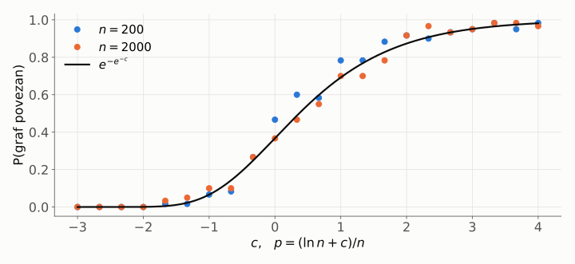

$$
p = \frac{\ln n + c}{n} \quad\Longrightarrow\quad P(G \text{ povezan}) \to e^{-e^{-c}}
$$

---

<!-- _class: lead -->

# VII
# Od rezultata do teorije

---

# Indukcija i dedukcija

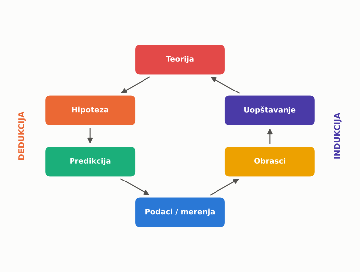

---

# Hipoteza → teorija

<br>

| Korak | Pitanje |
|---|---|
| hipoteza | da li je proverljiva? |
| eksperiment | da li podaci slažu? |
| ponovljivost | da li drugi dobijaju isto? |
| objašnjenje | **zašto** važi? (model, dokaz) |
| teorija | da li predviđa **nešto novo**? |

---

# Šta smo videli

<br>

$$
\underbrace{y = f(x) + \varepsilon}_{\text{eksperiment}}
\;\longrightarrow\;
\underbrace{\varepsilon \approx N(0,\sigma^2)}_{\text{CGT}}
\;\longrightarrow\;
\underbrace{\bar x \pm 1.96\,\tfrac{s}{\sqrt n}}_{\text{odluka}}
$$

<br>

$$
\underbrace{C_n / (n \ln n)}_{\text{merenje}}
\;\longleftrightarrow\;
\underbrace{2(n+1)H_n - 4n}_{\text{teorija}}
$$

---


# I ispočetka

Svaka teorija je samo hipoteza koju **još nismo oborili**.

---

<!-- _class: lead -->
<!-- _paginate: false -->

# Pitanja?

## Hvala!
